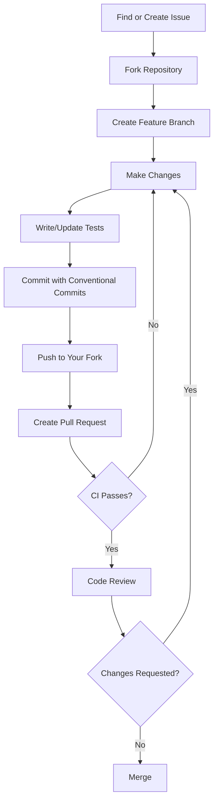

# Contributing to OpenDSA

Thank you for your interest in contributing to OpenDSA! This document provides guidelines and instructions for contributing to the project.

## Table of Contents

1. [Code of Conduct](#code-of-conduct)
2. [Getting Started](#getting-started)
3. [Development Setup](#development-setup)
4. [Project Structure](#project-structure)
5. [Making Contributions](#making-contributions)
6. [Adding a New Visualizer](#adding-a-new-visualizer)
7. [Code Style Guide](#code-style-guide)
8. [Commit Guidelines](#commit-guidelines)
9. [Pull Request Process](#pull-request-process)
10. [Issue Guidelines](#issue-guidelines)
11. [Community](#community)

---

## Code of Conduct

By participating in this project, you agree to abide by our [Code of Conduct](CODE_OF_CONDUCT.md). Please read it before contributing.

**Key Points**:
- Be respectful and inclusive
- Welcome newcomers
- Accept constructive criticism
- Focus on what's best for the community

---

## Getting Started

### Prerequisites

Before you begin, ensure you have the following installed:

- **Node.js**: v18.17 or higher ([Download](https://nodejs.org/))
- **pnpm**: v8 or higher (`npm install -g pnpm`)
- **Git**: Latest version ([Download](https://git-scm.com/))

### Quick Start

```bash
# 1. Fork the repository on GitHub

# 2. Clone your fork
git clone https://github.com/soloshun/opendsa.git
cd opendsa

# 3. Add upstream remote
git remote add upstream https://github.com/soloshun/opendsa.git

# 4. Install dependencies
pnpm install

# 5. Start development server
pnpm dev
```

---

## Development Setup

### Installing Dependencies

```bash
# Install all dependencies for the monorepo
pnpm install
```

### Running Development Servers

```bash
# Run all apps in development mode
pnpm dev

# Run specific app
pnpm dev --filter=@opendsa/app
pnpm dev --filter=@opendsa/web
pnpm dev --filter=@opendsa/docs
```

### Building

```bash
# Build all packages and apps
pnpm build

# Build specific package
pnpm build --filter=@opendsa/algorithms
```

### Testing

```bash
# Run all tests
pnpm test

# Run tests in watch mode
pnpm test:watch

# Run tests for specific package
pnpm test --filter=@opendsa/algorithms

# Run E2E tests
pnpm test:e2e
```

### Linting and Formatting

```bash
# Run linter
pnpm lint

# Fix lint issues
pnpm lint:fix

# Format code
pnpm format

# Type check
pnpm type-check
```

---

## Project Structure

```
opendsa/
├── apps/
│   ├── web/              # Marketing website
│   ├── app/              # Main visualizer application
│   └── docs/             # Documentation site
│
├── packages/
│   ├── ui/               # Shared UI components
│   ├── algorithms/       # Algorithm implementations
│   ├── visualizers/      # Visualization components
│   ├── types/            # Shared TypeScript types
│   ├── utils/            # Shared utilities
│   └── config/           # Shared configurations
│
├── .github/              # GitHub workflows and templates
├── turbo.json            # Turborepo configuration
└── package.json          # Root package.json
```

### Package Overview

| Package | Description | Key Files |
|---------|-------------|-----------|
| `@opendsa/app` | Main visualizer app | `app/`, `components/` |
| `@opendsa/web` | Marketing website | `app/`, `components/` |
| `@opendsa/docs` | Documentation | `pages/` |
| `@opendsa/ui` | UI components | `src/components/` |
| `@opendsa/algorithms` | Pure algorithms | `src/sorting/`, `src/searching/` |
| `@opendsa/visualizers` | Visualizer components | `src/engine/`, `src/sorting/` |
| `@opendsa/types` | TypeScript types | `src/*.types.ts` |
| `@opendsa/utils` | Utility functions | `src/` |

---

## Making Contributions

### Types of Contributions

We welcome many types of contributions:

- **Bug Fixes**: Fix issues in existing code
- **New Features**: Add new functionality
- **New Visualizers**: Add algorithm visualizations
- **Documentation**: Improve or add documentation
- **Tests**: Add or improve tests
- **UI/UX**: Improve user interface and experience
- **Performance**: Optimize existing code
- **Accessibility**: Improve accessibility

### Contribution Workflow



### Branch Naming

Use descriptive branch names:

```
feature/add-quicksort-visualizer
fix/bubble-sort-animation-bug
docs/improve-contributing-guide
refactor/animation-engine
test/add-merge-sort-tests
```

Format: `<type>/<short-description>`

Types:
- `feature/` - New features
- `fix/` - Bug fixes
- `docs/` - Documentation changes
- `refactor/` - Code refactoring
- `test/` - Test additions/changes
- `chore/` - Maintenance tasks

---

## Adding a New Visualizer

This is the most common contribution. Follow this guide to add a new algorithm visualizer.

### Step 1: Create the Algorithm Implementation

Create the pure algorithm in `packages/algorithms`:

```typescript
// packages/algorithms/src/sorting/insertion-sort.ts

import type { AnimationStep } from '@opendsa/types';

/**
 * Insertion Sort Algorithm
 * Time: O(n^2) average, O(n) best | Space: O(1)
 */
export function insertionSort(array: number[]): number[] {
  const arr = [...array];
  
  for (let i = 1; i < arr.length; i++) {
    const key = arr[i];
    let j = i - 1;
    
    while (j >= 0 && arr[j] > key) {
      arr[j + 1] = arr[j];
      j--;
    }
    arr[j + 1] = key;
  }
  
  return arr;
}

/**
 * Generate animation steps for Insertion Sort
 */
export function insertionSortSteps(array: number[]): AnimationStep[] {
  const steps: AnimationStep[] = [];
  const arr = [...array];
  
  // Initial state
  steps.push({
    id: `step-0`,
    type: 'highlight',
    indices: [],
    description: 'Starting insertion sort',
    codeLineNumbers: [1],
  });
  
  for (let i = 1; i < arr.length; i++) {
    const key = arr[i];
    let j = i - 1;
    
    // Highlight current element
    steps.push({
      id: `step-${steps.length}`,
      type: 'highlight',
      indices: [i],
      description: `Select element ${key} at index ${i}`,
      codeLineNumbers: [4, 5],
    });
    
    while (j >= 0 && arr[j] > key) {
      // Compare
      steps.push({
        id: `step-${steps.length}`,
        type: 'compare',
        indices: [j, j + 1],
        description: `Compare ${arr[j]} with ${key}`,
        codeLineNumbers: [7],
      });
      
      // Shift
      arr[j + 1] = arr[j];
      steps.push({
        id: `step-${steps.length}`,
        type: 'swap',
        indices: [j, j + 1],
        values: [...arr],
        description: `Shift ${arr[j]} to the right`,
        codeLineNumbers: [8],
      });
      
      j--;
    }
    
    // Insert
    arr[j + 1] = key;
    steps.push({
      id: `step-${steps.length}`,
      type: 'insert',
      indices: [j + 1],
      values: [...arr],
      description: `Insert ${key} at index ${j + 1}`,
      codeLineNumbers: [10],
    });
  }
  
  // Mark all as sorted
  steps.push({
    id: `step-${steps.length}`,
    type: 'mark-sorted',
    indices: arr.map((_, i) => i),
    description: 'Array is sorted!',
    codeLineNumbers: [12],
  });
  
  return steps;
}
```

### Step 2: Add Tests

```typescript
// packages/algorithms/src/sorting/__tests__/insertion-sort.test.ts

import { describe, it, expect } from 'vitest';
import { insertionSort, insertionSortSteps } from '../insertion-sort';

describe('insertionSort', () => {
  it('sorts an array correctly', () => {
    expect(insertionSort([5, 3, 8, 1, 2])).toEqual([1, 2, 3, 5, 8]);
  });

  it('handles empty array', () => {
    expect(insertionSort([])).toEqual([]);
  });

  it('handles single element', () => {
    expect(insertionSort([1])).toEqual([1]);
  });

  it('handles already sorted array', () => {
    expect(insertionSort([1, 2, 3, 4, 5])).toEqual([1, 2, 3, 4, 5]);
  });

  it('handles reverse sorted array', () => {
    expect(insertionSort([5, 4, 3, 2, 1])).toEqual([1, 2, 3, 4, 5]);
  });

  it('handles duplicates', () => {
    expect(insertionSort([3, 1, 3, 2, 1])).toEqual([1, 1, 2, 3, 3]);
  });
});

describe('insertionSortSteps', () => {
  it('generates correct number of steps', () => {
    const steps = insertionSortSteps([3, 1, 2]);
    expect(steps.length).toBeGreaterThan(0);
  });

  it('first step is highlight', () => {
    const steps = insertionSortSteps([3, 1, 2]);
    expect(steps[0].type).toBe('highlight');
  });

  it('last step marks all as sorted', () => {
    const steps = insertionSortSteps([3, 1, 2]);
    expect(steps[steps.length - 1].type).toBe('mark-sorted');
  });
});
```

### Step 3: Create the Visualizer Component

```typescript
// packages/visualizers/src/sorting/InsertionSortVisualizer.tsx

'use client';

import { useRef, useEffect, useMemo } from 'react';
import { motion, AnimatePresence } from 'framer-motion';
import type { VisualizerProps, AnimationStep } from '@opendsa/types';
import { cn } from '@opendsa/utils';

interface InsertionSortProps extends VisualizerProps<number[]> {}

export function InsertionSortVisualizer({
  data,
  currentStep,
  steps,
  isPlaying,
  speed,
}: InsertionSortProps) {
  const containerRef = useRef<HTMLDivElement>(null);
  
  const currentStepData = steps[currentStep];
  const maxValue = useMemo(() => Math.max(...data, 1), [data]);
  
  // Get the current state of the array at this step
  const displayArray = useMemo(() => {
    if (currentStepData?.values) {
      return currentStepData.values as number[];
    }
    return data;
  }, [currentStepData, data]);
  
  const getBarColor = (index: number): string => {
    if (!currentStepData) return 'bg-primary';
    
    const { type, indices } = currentStepData;
    
    if (type === 'mark-sorted' && indices.includes(index)) {
      return 'bg-green-500';
    }
    if (type === 'compare' && indices.includes(index)) {
      return 'bg-yellow-500';
    }
    if (type === 'swap' && indices.includes(index)) {
      return 'bg-red-500';
    }
    if (type === 'highlight' && indices.includes(index)) {
      return 'bg-blue-500';
    }
    if (type === 'insert' && indices.includes(index)) {
      return 'bg-purple-500';
    }
    
    return 'bg-primary';
  };
  
  return (
    <div
      ref={containerRef}
      className="flex items-end justify-center gap-1 h-full w-full p-4"
    >
      <AnimatePresence mode="popLayout">
        {displayArray.map((value, index) => (
          <motion.div
            key={`bar-${index}`}
            layout
            initial={{ opacity: 0, y: 20 }}
            animate={{ opacity: 1, y: 0 }}
            exit={{ opacity: 0, y: -20 }}
            transition={{ duration: 0.2 }}
            className={cn(
              'flex flex-col items-center justify-end rounded-t-md transition-colors duration-200',
              getBarColor(index)
            )}
            style={{
              height: `${(value / maxValue) * 100}%`,
              width: `${Math.max(100 / displayArray.length - 2, 20)}px`,
              minWidth: '20px',
              maxWidth: '60px',
            }}
          >
            {displayArray.length <= 20 && (
              <span className="text-xs text-white font-medium mb-1">
                {value}
              </span>
            )}
          </motion.div>
        ))}
      </AnimatePresence>
    </div>
  );
}
```

### Step 4: Create the Controls Component

```typescript
// packages/visualizers/src/sorting/InsertionSortControls.tsx

'use client';

import { useState } from 'react';
import { 
  Button, 
  Slider, 
  Input,
  Card,
  CardContent,
} from '@opendsa/ui';
import { 
  Play, 
  Pause, 
  RotateCcw, 
  SkipBack, 
  SkipForward,
  Shuffle,
} from 'lucide-react';
import type { ControlsProps } from '@opendsa/types';

export function InsertionSortControls({
  onPlay,
  onPause,
  onReset,
  onStepForward,
  onStepBackward,
  onSpeedChange,
  onDataChange,
  isPlaying,
  currentStep,
  totalSteps,
  speed,
}: ControlsProps) {
  const [arraySize, setArraySize] = useState(10);
  
  const generateRandomArray = () => {
    const newArray = Array.from(
      { length: arraySize },
      () => Math.floor(Math.random() * 100) + 1
    );
    onDataChange(newArray);
  };
  
  return (
    <Card>
      <CardContent className="p-4 space-y-4">
        {/* Playback Controls */}
        <div className="flex items-center justify-center gap-2">
          <Button
            variant="outline"
            size="icon"
            onClick={onStepBackward}
            disabled={isPlaying || currentStep === 0}
          >
            <SkipBack className="h-4 w-4" />
          </Button>
          
          <Button
            variant="default"
            size="icon"
            onClick={isPlaying ? onPause : onPlay}
          >
            {isPlaying ? (
              <Pause className="h-4 w-4" />
            ) : (
              <Play className="h-4 w-4" />
            )}
          </Button>
          
          <Button
            variant="outline"
            size="icon"
            onClick={onStepForward}
            disabled={isPlaying || currentStep >= totalSteps - 1}
          >
            <SkipForward className="h-4 w-4" />
          </Button>
          
          <Button
            variant="outline"
            size="icon"
            onClick={onReset}
          >
            <RotateCcw className="h-4 w-4" />
          </Button>
        </div>
        
        {/* Progress */}
        <div className="text-center text-sm text-muted-foreground">
          Step {currentStep + 1} of {totalSteps}
        </div>
        
        {/* Speed Control */}
        <div className="space-y-2">
          <label className="text-sm font-medium">Speed</label>
          <Slider
            value={[speed]}
            onValueChange={([value]) => onSpeedChange(value)}
            min={1}
            max={100}
            step={1}
          />
        </div>
        
        {/* Array Controls */}
        <div className="flex gap-2">
          <Input
            type="number"
            value={arraySize}
            onChange={(e) => setArraySize(Number(e.target.value))}
            min={2}
            max={50}
            className="w-20"
          />
          <Button
            variant="secondary"
            onClick={generateRandomArray}
            className="flex-1"
          >
            <Shuffle className="h-4 w-4 mr-2" />
            Generate
          </Button>
        </div>
      </CardContent>
    </Card>
  );
}
```

### Step 5: Register the Visualizer

```typescript
// packages/visualizers/src/sorting/insertion-sort-plugin.ts

import type { VisualizerPlugin } from '@opendsa/types';
import { insertionSortSteps } from '@opendsa/algorithms';
import { InsertionSortVisualizer } from './InsertionSortVisualizer';
import { InsertionSortControls } from './InsertionSortControls';

export const insertionSortPlugin: VisualizerPlugin<number[]> = {
  meta: {
    id: 'insertion-sort',
    name: 'Insertion Sort',
    category: 'sorting',
    description: 'A simple sorting algorithm that builds the sorted array one element at a time.',
    complexity: {
      time: {
        best: 'O(n)',
        average: 'O(n²)',
        worst: 'O(n²)',
      },
      space: 'O(1)',
    },
    tags: ['sorting', 'comparison', 'in-place', 'stable'],
    difficulty: 'beginner',
  },
  component: InsertionSortVisualizer,
  controls: InsertionSortControls,
  generateSteps: insertionSortSteps,
  defaultInput: [64, 34, 25, 12, 22, 11, 90],
  defaultCode: `function insertionSort(arr) {
  for (let i = 1; i < arr.length; i++) {
    let key = arr[i];
    let j = i - 1;
    
    while (j >= 0 && arr[j] > key) {
      arr[j + 1] = arr[j];
      j--;
    }
    arr[j + 1] = key;
  }
  return arr;
}`,
};

// Register in packages/visualizers/src/registry.ts
import { registry } from './registry';
import { insertionSortPlugin } from './sorting/insertion-sort-plugin';

registry.register(insertionSortPlugin);
```

### Step 6: Export from Package

```typescript
// packages/visualizers/src/index.ts

// ... existing exports
export { InsertionSortVisualizer } from './sorting/InsertionSortVisualizer';
export { InsertionSortControls } from './sorting/InsertionSortControls';
export { insertionSortPlugin } from './sorting/insertion-sort-plugin';
```

### Step 7: Add Documentation

Create a documentation page explaining the algorithm:

```mdx
// apps/docs/pages/algorithms/sorting/insertion-sort.mdx

---
title: Insertion Sort
description: Learn how insertion sort works with interactive visualization
---

# Insertion Sort

Insertion sort is a simple sorting algorithm that builds the final sorted array
one item at a time.

## How It Works

1. Start from the second element (index 1)
2. Compare it with elements before it
3. Shift larger elements to the right
4. Insert the element in its correct position
5. Repeat for all elements

## Complexity

| Case | Time | Space |
|------|------|-------|
| Best | O(n) | O(1) |
| Average | O(n²) | O(1) |
| Worst | O(n²) | O(1) |

## When to Use

- Small datasets
- Nearly sorted arrays
- Online sorting (sorting as data arrives)
- When simplicity is preferred over performance

## Interactive Demo

Visit the [Insertion Sort Visualizer](/visualize/sorting/insertion-sort) to see
the algorithm in action.
```

---

## Code Style Guide

### TypeScript

- Use strict mode
- Prefer `interface` over `type` for object shapes
- Use descriptive variable names
- Add JSDoc comments for public APIs

```typescript
// Good
interface UserPreferences {
  theme: 'light' | 'dark' | 'system';
  fontSize: number;
}

/**
 * Updates user preferences in storage
 * @param preferences - The preferences to save
 * @returns Promise that resolves when saved
 */
async function savePreferences(preferences: UserPreferences): Promise<void> {
  // Implementation
}

// Avoid
type prefs = { t: string; fs: number };
const save = async (p: any) => { /* ... */ };
```

### React Components

- Use functional components with hooks
- Prefer named exports
- Use TypeScript for props
- Extract complex logic to custom hooks

```typescript
// Good
interface ButtonProps {
  variant?: 'primary' | 'secondary';
  children: React.ReactNode;
  onClick?: () => void;
}

export function Button({ variant = 'primary', children, onClick }: ButtonProps) {
  return (
    <button
      className={cn('btn', `btn-${variant}`)}
      onClick={onClick}
    >
      {children}
    </button>
  );
}
```

### File Organization

```
ComponentName/
├── ComponentName.tsx      # Main component
├── ComponentName.test.tsx # Tests
├── use-component-name.ts  # Custom hook (if needed)
├── types.ts               # Types (if complex)
└── index.ts               # Exports
```

---

## Commit Guidelines

We use [Conventional Commits](https://www.conventionalcommits.org/) for clear, automated changelogs.

### Format

```
<type>(<scope>): <description>

[optional body]

[optional footer]
```

### Types

| Type | Description |
|------|-------------|
| `feat` | New feature |
| `fix` | Bug fix |
| `docs` | Documentation changes |
| `style` | Code style changes (formatting) |
| `refactor` | Code refactoring |
| `perf` | Performance improvements |
| `test` | Adding or updating tests |
| `chore` | Maintenance tasks |
| `ci` | CI/CD changes |

### Examples

```bash
# Feature
feat(visualizers): add insertion sort visualizer

# Bug fix
fix(animation): resolve timing issue in bubble sort

# Documentation
docs(contributing): add visualizer creation guide

# Multiple scopes
feat(algorithms,visualizers): add binary search
```

### Commit Message Guidelines

- Use imperative mood ("add" not "added")
- First line max 72 characters
- Reference issues in footer: `Closes #123`

---

## Pull Request Process

### Before Creating a PR

1. **Sync with upstream**
   ```bash
   git fetch upstream
   git rebase upstream/dev
   ```

2. **Run all checks**
   ```bash
   pnpm lint
   pnpm type-check
   pnpm test
   pnpm build
   ```

3. **Update documentation** if needed

### PR Template

When you create a PR, fill out the template:

```markdown
## Description
Brief description of changes

## Type of Change
- [ ] Bug fix
- [ ] New feature
- [ ] Documentation
- [ ] Refactoring

## Related Issues
Closes #123

## Checklist
- [ ] My code follows the code style
- [ ] I have added tests
- [ ] All tests pass
- [ ] I have updated documentation
- [ ] I have added a changeset (if applicable)

## Screenshots (if applicable)
```

### Review Process

1. **CI Checks**: All automated checks must pass
2. **Code Review**: At least 1 maintainer approval
3. **Discussion**: Address all comments
4. **Merge**: Maintainer merges when ready

### After Merge

- Delete your feature branch
- Pull latest changes
- Celebrate your contribution!

---

## Issue Guidelines

### Bug Reports

Use the bug report template:

```markdown
**Describe the bug**
Clear description of the bug

**To Reproduce**
1. Go to '...'
2. Click on '....'
3. See error

**Expected behavior**
What should happen

**Screenshots**
If applicable

**Environment**
- OS: [e.g. Windows 11]
- Browser: [e.g. Chrome 120]
- Version: [e.g. 1.0.0]
```

### Feature Requests

Use the feature request template:

```markdown
**Is your feature request related to a problem?**
Clear description of the problem

**Describe the solution you'd like**
What you want to happen

**Describe alternatives you've considered**
Other solutions you've thought about

**Additional context**
Any other information
```

### Visualizer Requests

Use the new visualizer template:

```markdown
**Algorithm/Data Structure**
Name of the algorithm

**Category**
- [ ] Sorting
- [ ] Searching
- [ ] Graph
- [ ] Tree
- [ ] Dynamic Programming
- [ ] Data Structure

**Description**
Brief description of the algorithm

**Complexity**
- Time: O(?)
- Space: O(?)

**Resources**
Links to explanations, Wikipedia, etc.

**Would you like to implement this?**
- [ ] Yes, I'd like to work on this
- [ ] No, just suggesting
```

---

## Community

### Discord

Join our Discord server for:
- Real-time help
- Feature discussions
- Showing off your contributions
- Connecting with other contributors

[Join Discord](https://discord.gg/mfQvUa2y4r)

### Getting Help

- **Discord**: Quick questions, discussions
- **GitHub Issues**: Bugs, features, documentation
- **GitHub Discussions**: General questions, ideas

### Recognition

We appreciate all contributions! Contributors are:
- Listed in our README
- Mentioned in release notes
- Eligible for contributor badges

---

## License

By contributing to OpenDSA, you agree that your contributions will be licensed under the MIT License.

---

Thank you for contributing to OpenDSA! Your efforts help make algorithm learning more accessible to everyone.
