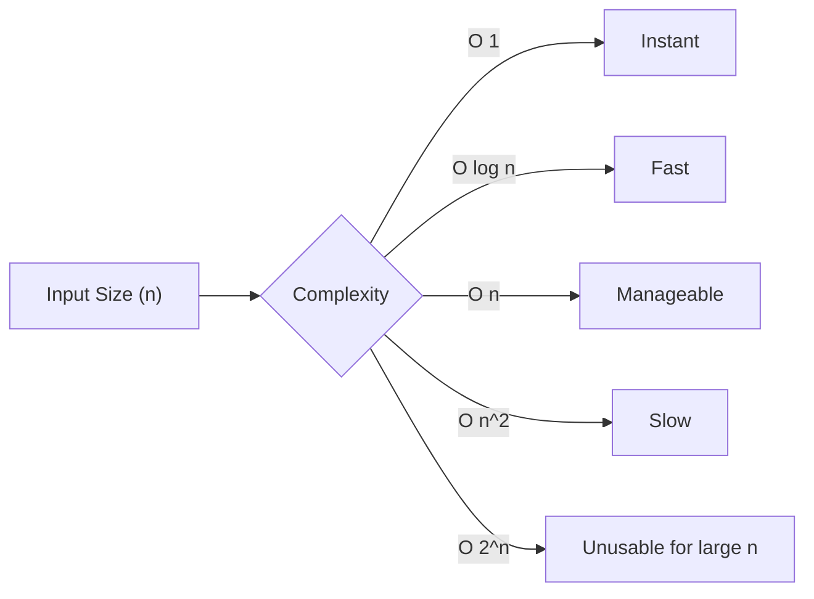

# Big O Notation (Full Content Coming Soon)

Big O notation is a mathematical notation that describes the limiting behavior of a function when the argument tends towards a particular value or infinity. In computer science, it is used to classify algorithms according to how their run time or space requirements grow as the input size grows.

## Common Time Complexities

| Notation | Name | Description | Example |
| :--- | :--- | :--- | :--- |
| **O(1)** | Constant | Execution time is independent of input size. | Accessing array index |
| **O(log n)** | Logarithmic | Time grows logarithmically with input size. | Binary Search |
| **O(n)** | Linear | Time grows linearly with input size. | Linear Search |
| **O(n log n)** | Linearithmic | Faster than quadratic but slower than linear. | Merge Sort, Quick Sort |
| **O(n²)** | Quadratic | Time grows with the square of the input size. | Bubble Sort |
| **O(2ⁿ)** | Exponential | Time doubles with each addition to input. | Recursive Fibonacci |
| **O(n!)** | Factorial | Growth is factorial based on input size. | Traveling Salesperson |

## Why it Matters

Understanding Big O helps developers:
- Predict performance at scale.
- Choose the right algorithm for the job.
- Identify bottlenecks in code.

### Visualizing Growth

