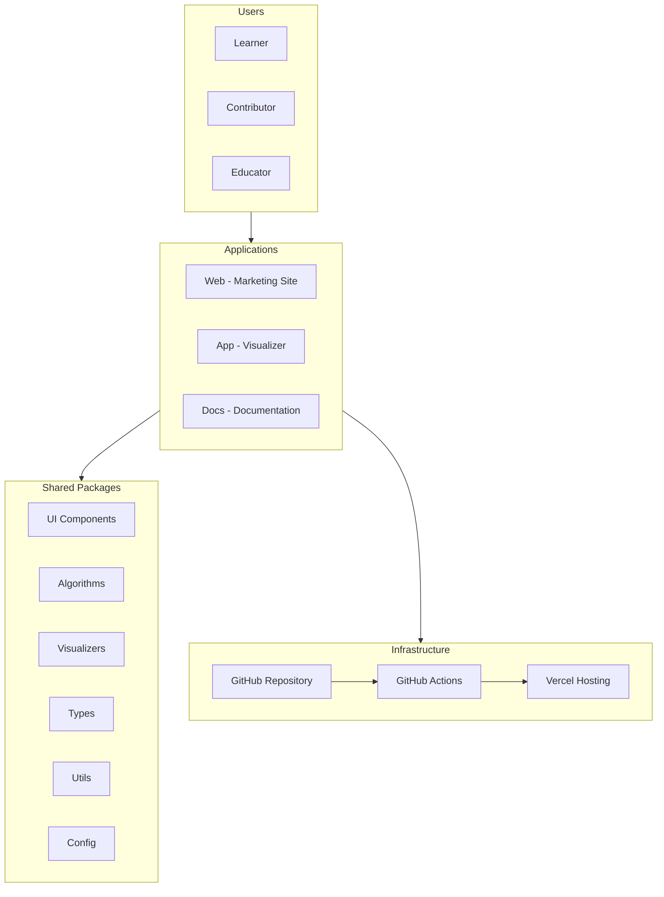
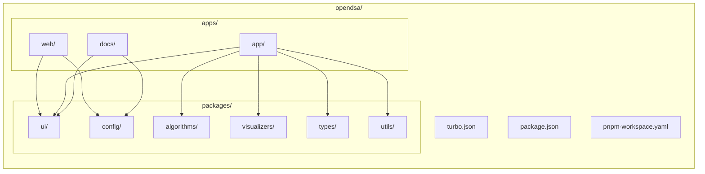
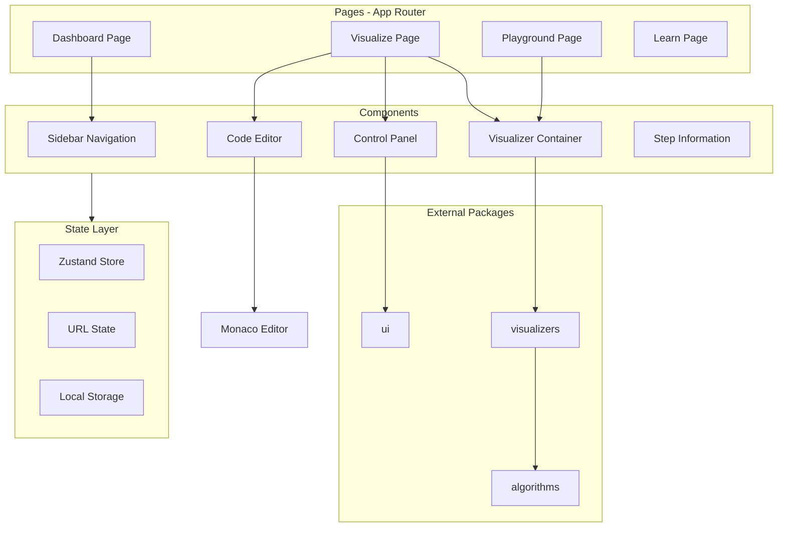
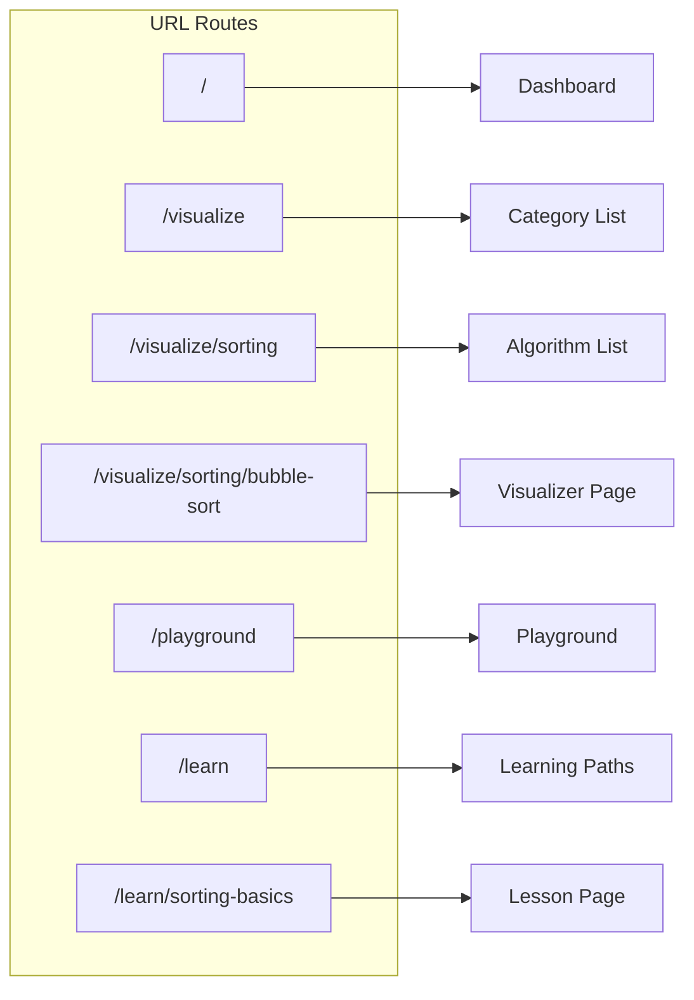
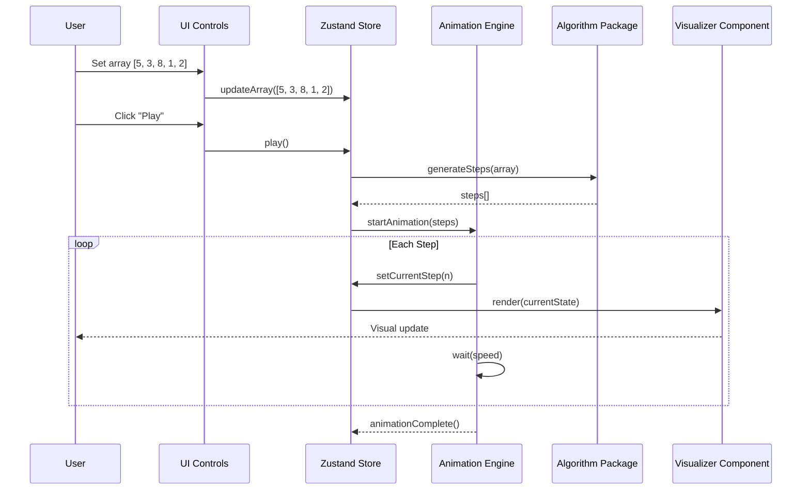
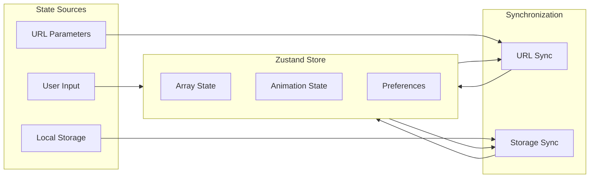
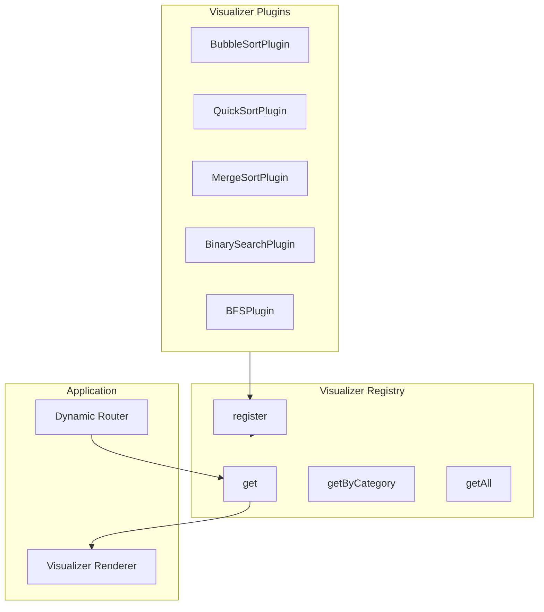
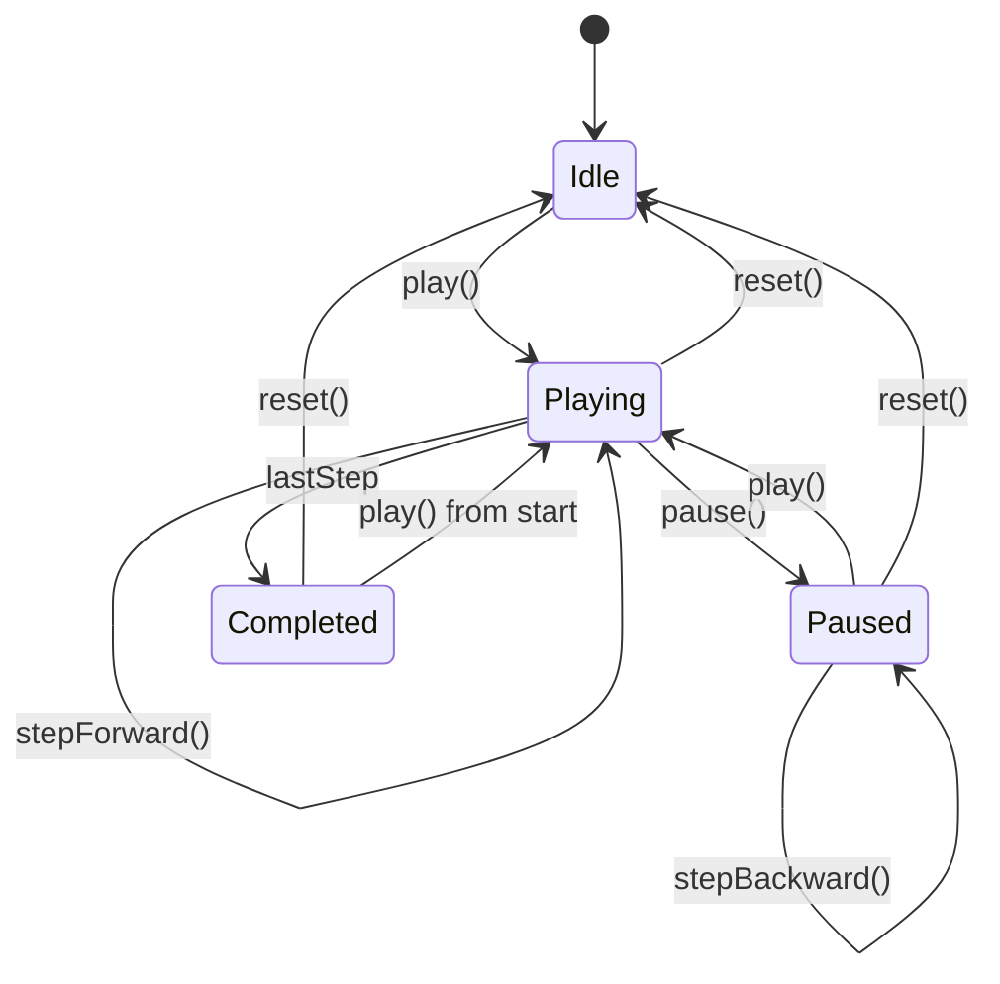
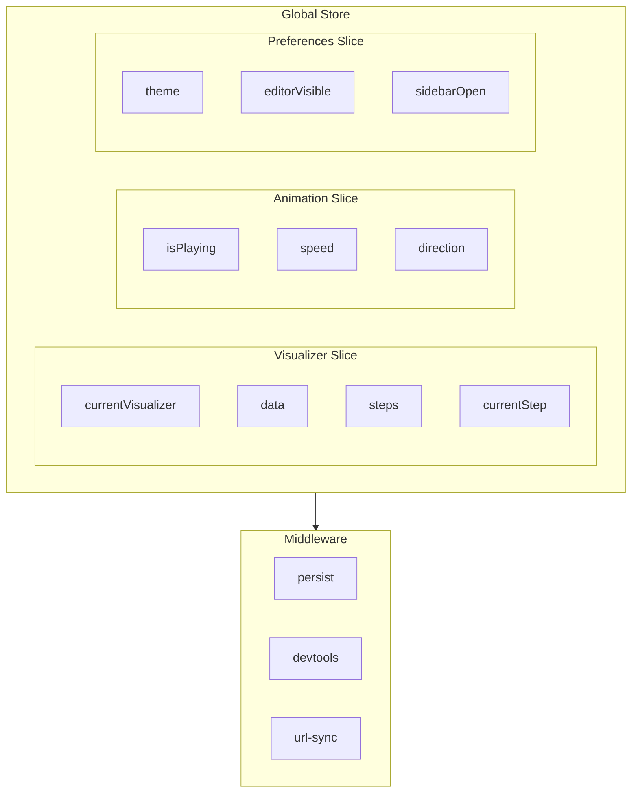
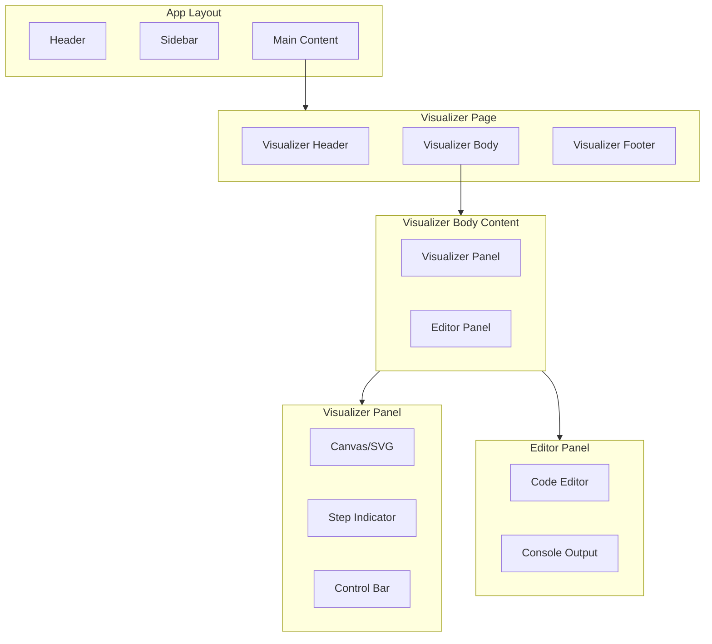

# OpenDSA - System Architecture

> Comprehensive architecture documentation for the OpenDSA algorithm visualization platform.

## Table of Contents

1. [Overview](#overview)
2. [High-Level Architecture](#high-level-architecture)
3. [Monorepo Structure](#monorepo-structure)
4. [Application Architecture](#application-architecture)
5. [Data Flow](#data-flow)
6. [Visualizer Plugin System](#visualizer-plugin-system)
7. [Animation Engine](#animation-engine)
8. [State Management](#state-management)
9. [Component Architecture](#component-architecture)
10. [API Design](#api-design)

---

## Overview

OpenDSA is built as a **Turborepo monorepo** containing multiple applications and shared packages. This architecture enables:

- **Code reuse** across applications (website, app, docs)
- **Independent deployments** for each application
- **Shared packages** for algorithms, UI components, and utilities
- **Scalable contributor experience** with clear boundaries

---

## High-Level Architecture



---

## Monorepo Structure



### Directory Details

```
opendsa/
├── apps/
│   ├── web/                      # Marketing website
│   │   ├── app/                  # Next.js App Router pages
│   │   │   ├── page.tsx          # Landing page
│   │   │   ├── features/         # Features page
│   │   │   ├── community/        # Community page
│   │   │   ├── blog/             # Blog (MDX)
│   │   │   └── layout.tsx        # Root layout
│   │   ├── components/           # Website-specific components
│   │   ├── public/               # Static assets
│   │   └── package.json
│   │
│   ├── app/                      # Main visualizer application
│   │   ├── app/                  # Next.js App Router pages
│   │   │   ├── page.tsx          # Dashboard
│   │   │   ├── visualize/        # Visualizer routes
│   │   │   │   └── [category]/
│   │   │   │       └── [algorithm]/
│   │   │   │           └── page.tsx
│   │   │   ├── playground/       # Playground mode
│   │   │   ├── learn/            # Learning paths
│   │   │   └── layout.tsx        # App layout
│   │   ├── components/           # App-specific components
│   │   │   ├── visualizer/       # Visualizer wrappers
│   │   │   ├── controls/         # Control panels
│   │   │   ├── editor/           # Code editor
│   │   │   └── sidebar/          # Navigation sidebar
│   │   ├── lib/                  # App utilities
│   │   │   ├── store.ts          # Zustand store
│   │   │   └── hooks/            # Custom hooks
│   │   └── package.json
│   │
│   └── docs/                     # Documentation site
│       ├── pages/                # Nextra pages
│       ├── theme.config.tsx      # Nextra config
│       └── package.json
│
├── packages/
│   ├── ui/                       # Shared UI components
│   │   ├── src/
│   │   │   ├── components/       # shadcn/ui based components
│   │   │   │   ├── button.tsx
│   │   │   │   ├── card.tsx
│   │   │   │   ├── slider.tsx
│   │   │   │   └── ...
│   │   │   └── index.ts          # Public exports
│   │   └── package.json
│   │
│   ├── algorithms/               # Pure algorithm implementations
│   │   ├── src/
│   │   │   ├── sorting/
│   │   │   │   ├── bubble-sort.ts
│   │   │   │   ├── quick-sort.ts
│   │   │   │   ├── merge-sort.ts
│   │   │   │   ├── insertion-sort.ts
│   │   │   │   ├── selection-sort.ts
│   │   │   │   └── index.ts
│   │   │   ├── searching/
│   │   │   │   ├── linear-search.ts
│   │   │   │   ├── binary-search.ts
│   │   │   │   ├── jump-search.ts
│   │   │   │   └── index.ts
│   │   │   ├── graph/
│   │   │   │   ├── bfs.ts
│   │   │   │   ├── dfs.ts
│   │   │   │   ├── dijkstra.ts
│   │   │   │   └── index.ts
│   │   │   ├── tree/
│   │   │   │   ├── bst.ts
│   │   │   │   ├── traversals.ts
│   │   │   │   └── index.ts
│   │   │   └── index.ts
│   │   ├── tests/
│   │   └── package.json
│   │
│   ├── visualizers/              # Visualization components
│   │   ├── src/
│   │   │   ├── engine/           # Animation engine
│   │   │   │   ├── types.ts
│   │   │   │   ├── animation-engine.ts
│   │   │   │   ├── use-animation.ts
│   │   │   │   └── index.ts
│   │   │   ├── sorting/
│   │   │   │   ├── BubbleSortVisualizer.tsx
│   │   │   │   ├── QuickSortVisualizer.tsx
│   │   │   │   └── index.ts
│   │   │   ├── searching/
│   │   │   ├── graph/
│   │   │   ├── tree/
│   │   │   ├── registry.ts       # Visualizer registry
│   │   │   └── index.ts
│   │   └── package.json
│   │
│   ├── types/                    # Shared TypeScript types
│   │   ├── src/
│   │   │   ├── algorithm.types.ts
│   │   │   ├── visualizer.types.ts
│   │   │   ├── animation.types.ts
│   │   │   └── index.ts
│   │   └── package.json
│   │
│   ├── utils/                    # Shared utilities
│   │   ├── src/
│   │   │   ├── array-utils.ts
│   │   │   ├── graph-utils.ts
│   │   │   ├── url-state.ts
│   │   │   └── index.ts
│   │   └── package.json
│   │
│   └── config/                   # Shared configurations
│       ├── eslint/
│       ├── typescript/
│       ├── tailwind/
│       └── package.json
│
├── .github/
│   ├── workflows/
│   │   ├── ci.yml
│   │   ├── release.yml
│   │   └── dependency-update.yml
│   ├── ISSUE_TEMPLATE/
│   │   ├── bug_report.md
│   │   ├── feature_request.md
│   │   └── new_visualizer.md
│   ├── PULL_REQUEST_TEMPLATE.md
│   └── CODEOWNERS
│
├── turbo.json
├── package.json
├── pnpm-workspace.yaml
├── CONTRIBUTING.md
├── CODE_OF_CONDUCT.md
├── LICENSE
└── README.md
```

---

## Application Architecture

### apps/app - Main Visualizer Application



### Page Routing Structure



---

## Data Flow

### Visualization Data Flow



### State Synchronization Flow



---

## Visualizer Plugin System

### Plugin Interface

```typescript
// packages/types/src/visualizer.types.ts

export type VisualizerCategory = 
  | 'sorting' 
  | 'searching' 
  | 'graph' 
  | 'tree' 
  | 'dp' 
  | 'data-structure';

export interface TimeComplexity {
  best: string;
  average: string;
  worst: string;
}

export interface Complexity {
  time: TimeComplexity;
  space: string;
}

export interface VisualizerMeta {
  id: string;
  name: string;
  category: VisualizerCategory;
  description: string;
  complexity: Complexity;
  tags: string[];
  difficulty: 'beginner' | 'intermediate' | 'advanced';
}

export interface VisualizerProps<T = unknown> {
  data: T;
  currentStep: number;
  steps: AnimationStep[];
  isPlaying: boolean;
  speed: number;
}

export interface ControlsProps {
  onPlay: () => void;
  onPause: () => void;
  onReset: () => void;
  onStepForward: () => void;
  onStepBackward: () => void;
  onSpeedChange: (speed: number) => void;
  onDataChange: (data: unknown) => void;
  isPlaying: boolean;
  currentStep: number;
  totalSteps: number;
  speed: number;
}

export interface VisualizerPlugin<TInput = unknown, TOptions = unknown> {
  meta: VisualizerMeta;
  component: React.ComponentType<VisualizerProps<TInput>>;
  controls: React.ComponentType<ControlsProps>;
  generateSteps: (input: TInput, options?: TOptions) => AnimationStep[];
  defaultInput: TInput;
  defaultCode: string;
  validateInput?: (input: unknown) => input is TInput;
}
```

### Plugin Registration



### Registry Implementation

```typescript
// packages/visualizers/src/registry.ts

import type { VisualizerPlugin, VisualizerCategory } from '@opendsa/types';

class VisualizerRegistry {
  private plugins: Map<string, VisualizerPlugin> = new Map();

  register(plugin: VisualizerPlugin): void {
    if (this.plugins.has(plugin.meta.id)) {
      console.warn(`Plugin ${plugin.meta.id} already registered. Overwriting.`);
    }
    this.plugins.set(plugin.meta.id, plugin);
  }

  get(id: string): VisualizerPlugin | undefined {
    return this.plugins.get(id);
  }

  getByCategory(category: VisualizerCategory): VisualizerPlugin[] {
    return Array.from(this.plugins.values())
      .filter(plugin => plugin.meta.category === category);
  }

  getAll(): VisualizerPlugin[] {
    return Array.from(this.plugins.values());
  }

  getCategories(): VisualizerCategory[] {
    const categories = new Set(
      Array.from(this.plugins.values()).map(p => p.meta.category)
    );
    return Array.from(categories);
  }
}

export const registry = new VisualizerRegistry();
```

---

## Animation Engine

### Animation Types

```typescript
// packages/types/src/animation.types.ts

export type StepType = 
  | 'compare'
  | 'swap'
  | 'highlight'
  | 'insert'
  | 'delete'
  | 'visit'
  | 'mark-sorted'
  | 'mark-found'
  | 'pivot'
  | 'partition';

export interface AnimationStep {
  id: string;
  type: StepType;
  indices: number[];
  values?: unknown[];
  description: string;
  codeLineNumbers?: number[];
  metadata?: Record<string, unknown>;
}

export interface AnimationState {
  steps: AnimationStep[];
  currentStep: number;
  isPlaying: boolean;
  speed: number; // 1-100, percentage
  direction: 'forward' | 'backward';
}

export interface AnimationControls {
  play: () => void;
  pause: () => void;
  reset: () => void;
  stepForward: () => void;
  stepBackward: () => void;
  goToStep: (step: number) => void;
  setSpeed: (speed: number) => void;
}
```

### Animation Engine Architecture



### Animation Hook

```typescript
// packages/visualizers/src/engine/use-animation.ts

import { useCallback, useEffect, useRef } from 'react';
import { useStore } from 'zustand';
import type { AnimationStep, AnimationControls } from '@opendsa/types';

interface UseAnimationOptions {
  steps: AnimationStep[];
  onStepChange?: (step: number, stepData: AnimationStep) => void;
  onComplete?: () => void;
}

export function useAnimation(options: UseAnimationOptions): AnimationControls {
  const { steps, onStepChange, onComplete } = options;
  const timerRef = useRef<NodeJS.Timeout | null>(null);
  
  // Implementation details...
  
  return {
    play,
    pause,
    reset,
    stepForward,
    stepBackward,
    goToStep,
    setSpeed,
  };
}
```

---

## State Management

### Zustand Store Structure



### Store Implementation

```typescript
// apps/app/lib/store.ts

import { create } from 'zustand';
import { persist, devtools } from 'zustand/middleware';
import type { AnimationStep } from '@opendsa/types';

interface VisualizerState {
  // Visualizer state
  currentVisualizer: string | null;
  data: unknown;
  steps: AnimationStep[];
  currentStep: number;
  
  // Animation state
  isPlaying: boolean;
  speed: number;
  
  // Actions
  setVisualizer: (id: string) => void;
  setData: (data: unknown) => void;
  setSteps: (steps: AnimationStep[]) => void;
  setCurrentStep: (step: number) => void;
  play: () => void;
  pause: () => void;
  reset: () => void;
  setSpeed: (speed: number) => void;
}

interface PreferencesState {
  theme: 'light' | 'dark' | 'system';
  editorVisible: boolean;
  sidebarOpen: boolean;
  
  setTheme: (theme: 'light' | 'dark' | 'system') => void;
  toggleEditor: () => void;
  toggleSidebar: () => void;
}

export const useVisualizerStore = create<VisualizerState>()(
  devtools(
    (set, get) => ({
      currentVisualizer: null,
      data: [],
      steps: [],
      currentStep: 0,
      isPlaying: false,
      speed: 50,
      
      setVisualizer: (id) => set({ currentVisualizer: id }),
      setData: (data) => set({ data }),
      setSteps: (steps) => set({ steps, currentStep: 0 }),
      setCurrentStep: (step) => set({ currentStep: step }),
      play: () => set({ isPlaying: true }),
      pause: () => set({ isPlaying: false }),
      reset: () => set({ currentStep: 0, isPlaying: false }),
      setSpeed: (speed) => set({ speed }),
    }),
    { name: 'visualizer-store' }
  )
);

export const usePreferencesStore = create<PreferencesState>()(
  persist(
    (set) => ({
      theme: 'system',
      editorVisible: true,
      sidebarOpen: true,
      
      setTheme: (theme) => set({ theme }),
      toggleEditor: () => set((state) => ({ editorVisible: !state.editorVisible })),
      toggleSidebar: () => set((state) => ({ sidebarOpen: !state.sidebarOpen })),
    }),
    { name: 'opendsa-preferences' }
  )
);
```

---

## Component Architecture

### Component Hierarchy



### Component Responsibilities

| Component | Responsibility |
|-----------|---------------|
| `AppLayout` | Global layout, navigation, theme |
| `Sidebar` | Algorithm/category navigation |
| `VisualizerPage` | Page-level state, data fetching |
| `VisualizerPanel` | Render visualization, handle resize |
| `ControlBar` | Play/pause, speed, step controls |
| `EditorPanel` | Code display, syntax highlighting |
| `StepIndicator` | Current step info, progress |

---

## API Design

### Internal Package APIs

```typescript
// @opendsa/algorithms - Algorithm package exports
export { bubbleSort, bubbleSortSteps } from './sorting/bubble-sort';
export { quickSort, quickSortSteps } from './sorting/quick-sort';
export { mergeSort, mergeSortSteps } from './sorting/merge-sort';
export { linearSearch, linearSearchSteps } from './searching/linear-search';
export { binarySearch, binarySearchSteps } from './searching/binary-search';
export { bfs, bfsSteps } from './graph/bfs';
export { dfs, dfsSteps } from './graph/dfs';

// @opendsa/visualizers - Visualizer package exports
export { registry } from './registry';
export { useAnimation } from './engine/use-animation';
export { BubbleSortVisualizer } from './sorting/BubbleSortVisualizer';
export { QuickSortVisualizer } from './sorting/QuickSortVisualizer';
// ... other visualizers

// @opendsa/ui - UI component exports
export { Button } from './components/button';
export { Card } from './components/card';
export { Slider } from './components/slider';
export { Input } from './components/input';
// ... other components

// @opendsa/types - Type exports
export type { AnimationStep, StepType } from './animation.types';
export type { VisualizerPlugin, VisualizerMeta } from './visualizer.types';
export type { AlgorithmResult } from './algorithm.types';
```

### URL State API

```typescript
// URL structure for sharing visualizations
// https://app.opendsa.dev/visualize/sorting/bubble-sort?data=5,3,8,1,2&step=5&speed=50

interface URLState {
  data?: string;      // Comma-separated values
  step?: number;      // Current step
  speed?: number;     // Animation speed (1-100)
  playing?: boolean;  // Auto-play on load
}

// Utility functions
export function encodeURLState(state: Partial<URLState>): string;
export function decodeURLState(search: string): Partial<URLState>;
export function useURLState(): [URLState, (state: Partial<URLState>) => void];
```

---

## Security Considerations

### Code Execution

- User code runs in a **sandboxed Web Worker**
- No access to DOM, localStorage, or network
- Execution timeout limits (5 seconds default)
- Memory limits enforced

### Input Validation

- All user inputs validated before processing
- Array size limits (max 100 elements for visualization)
- Value range limits
- Sanitization of any user-provided strings

---

## Performance Optimizations

### Rendering

- **Canvas API** for large array visualizations (>50 elements)
- **SVG** for smaller, more detailed visualizations
- **React.memo** for static components
- **useMemo/useCallback** for expensive computations

### Animation

- **RequestAnimationFrame** for smooth animations
- **Web Workers** for step generation (large inputs)
- **Virtualization** for step history (>1000 steps)

### Bundle Size

- **Tree shaking** enabled for all packages
- **Dynamic imports** for visualizers (code split per visualizer)
- **Lazy loading** for Monaco Editor

---

## Accessibility

### Requirements

- **WCAG 2.1 AA** compliance target
- **Keyboard navigation** for all controls
- **Screen reader** announcements for step changes
- **High contrast** mode support
- **Reduced motion** preference respected

### Implementation

```typescript
// Accessibility hook for visualizations
export function useA11yAnnouncements() {
  const announce = useCallback((message: string) => {
    // Use aria-live region to announce changes
  }, []);
  
  return { announce };
}
```

---

## Testing Strategy

### Unit Tests (Vitest)

- Algorithm correctness
- Step generation accuracy
- Utility functions
- Store actions/selectors

### Component Tests (Testing Library)

- Component rendering
- User interactions
- State updates
- Accessibility

### E2E Tests (Playwright)

- Full user flows
- Cross-browser testing
- Visual regression
- Performance benchmarks

---

## Conclusion

This architecture provides:

1. **Scalability** - Easy to add new algorithms and visualizers
2. **Maintainability** - Clear separation of concerns
3. **Contributor-friendly** - Well-defined plugin system
4. **Performance** - Optimized rendering and animations
5. **Accessibility** - Built-in from the start
6. **Type safety** - Full TypeScript coverage

The modular design ensures that OpenDSA can grow with its community while maintaining code quality and user experience.
