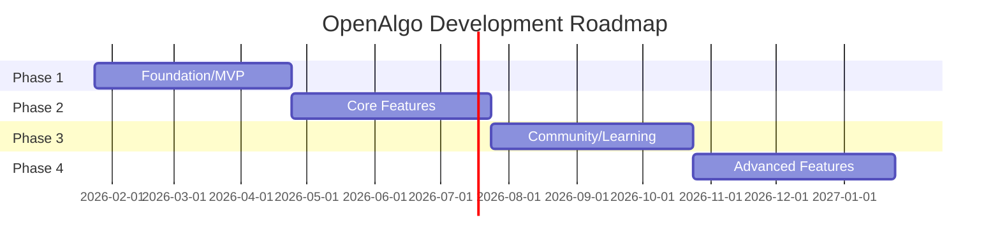

# OpenAlgo - Product Roadmap

> A phased approach to building the ultimate algorithm visualization platform.

## Table of Contents

1. [Vision](#vision)
2. [Roadmap Overview](#roadmap-overview)
3. [Phase 1: Foundation](#phase-1-foundation-mvp)
4. [Phase 2: Core Features](#phase-2-core-features)
5. [Phase 3: Community and Learning](#phase-3-community-and-learning)
6. [Phase 4: Advanced Features](#phase-4-advanced-features)
7. [Future Considerations](#future-considerations)
8. [Success Metrics](#success-metrics)

---

## Vision

**OpenAlgo** aims to be the go-to open-source platform for visualizing and learning data structures and algorithms. Our goal is to make algorithm education:

- **Visual**: See algorithms come to life
- **Interactive**: Control and experiment with algorithms
- **Accessible**: Free and open to everyone
- **Community-driven**: Built by learners, for learners

---

## Roadmap Overview

### Phase Summary

| Phase | Focus | Duration | Status |
|-------|-------|----------|--------|
| Phase 1 | Foundation & MVP | ~3 months | Planned |
| Phase 2 | Core Features | ~3 months | Planned |
| Phase 3 | Community & Learning | ~3 months | Planned |
| Phase 4 | Advanced Features | ~3 months | Planned |

---

## Phase 1: Foundation (MVP)

**Goal**: Establish the technical foundation and launch with essential features.

### 1.1 Infrastructure Setup

- [ ] **Repository Setup**
  - Initialize Turborepo monorepo
  - Configure pnpm workspaces
  - Set up TypeScript strict mode
  - Configure ESLint + Prettier
  - Set up Husky for git hooks

- [ ] **CI/CD Pipeline**
  - GitHub Actions for CI (lint, type-check, test, build)
  - Vercel deployment configuration
  - Preview deployments for PRs
  - Automated dependency updates (Dependabot)

- [ ] **Core Packages**
  - `@openalgo/types` - Shared TypeScript types
  - `@openalgo/config` - Shared configurations
  - `@openalgo/utils` - Utility functions

### 1.2 UI Component Library

- [ ] **Base Components** (`@openalgo/ui`)
  - Button, Input, Slider
  - Card, Dialog, Popover
  - Dropdown, Select, Tabs
  - Toast notifications
  - Theme provider (light/dark)

- [ ] **Visualizer Components**
  - Bar chart component (for sorting)
  - Array visualization component
  - Control panel component
  - Step indicator component
  - Speed slider component

### 1.3 Animation Engine

- [ ] **Core Engine** (`@openalgo/visualizers`)
  - Step-based animation system
  - Play/pause/reset controls
  - Step forward/backward
  - Speed control (1x - 10x)
  - Animation state management

- [ ] **Animation Hooks**
  - `useAnimation` hook
  - `useVisualizerStore` hook
  - Keyboard shortcuts support

### 1.4 Initial Algorithms

- [ ] **Sorting Algorithms** (`@openalgo/algorithms`)
  - Bubble Sort
  - Selection Sort
  - Insertion Sort
  - Quick Sort
  - Merge Sort

- [ ] **Searching Algorithms**
  - Linear Search
  - Binary Search

- [ ] **Data Structure Operations**
  - Array: insert, delete, update, search

### 1.5 Visualizer Application

- [ ] **App Structure** (`apps/app`)
  - Next.js App Router setup
  - Layout with sidebar navigation
  - Dynamic visualizer routes
  - Responsive design (tablet+)

- [ ] **Visualizer Pages**
  - Sorting algorithm visualizers (5)
  - Searching algorithm visualizers (2)
  - Array operations visualizer

- [ ] **Features**
  - Play/pause animations
  - Step-by-step mode
  - Speed control
  - Random array generation
  - Custom array input

### 1.6 Marketing Website

- [ ] **Landing Page** (`apps/web`)
  - Hero section with demo
  - Features overview
  - Algorithm categories
  - Call to action

- [ ] **Pages**
  - Home (landing)
  - Features
  - About

### 1.7 Documentation Site

- [ ] **Initial Docs** (`apps/docs`)
  - Getting started guide
  - Installation instructions
  - Quick start tutorial
  - Contributing guide

### 1.8 Launch Checklist

- [ ] Domain setup (openalgo.dev)
- [ ] SEO configuration
- [ ] Analytics setup
- [ ] Error tracking (Sentry)
- [ ] README and LICENSE
- [ ] Social media presence
- [ ] Launch announcement

---

## Phase 2: Core Features

**Goal**: Expand algorithm coverage and enhance the visualization experience.

### 2.1 Additional Sorting Algorithms

- [ ] Heap Sort
- [ ] Counting Sort
- [ ] Radix Sort
- [ ] Bucket Sort
- [ ] Shell Sort
- [ ] Tim Sort (simplified)

### 2.2 Additional Searching Algorithms

- [ ] Jump Search
- [ ] Interpolation Search
- [ ] Exponential Search
- [ ] Ternary Search

### 2.3 Graph Algorithms

- [ ] **Graph Data Structure**
  - Graph visualization component
  - Node/edge creation UI
  - Adjacency list/matrix views

- [ ] **Traversal Algorithms**
  - Breadth-First Search (BFS)
  - Depth-First Search (DFS)

- [ ] **Shortest Path**
  - Dijkstra's Algorithm
  - Bellman-Ford Algorithm
  - Floyd-Warshall Algorithm

- [ ] **Minimum Spanning Tree**
  - Prim's Algorithm
  - Kruskal's Algorithm

### 2.4 Tree Algorithms

- [ ] **Binary Search Tree**
  - Insert, Delete, Search
  - Tree visualization component
  - Balance visualization

- [ ] **Tree Traversals**
  - Inorder
  - Preorder
  - Postorder
  - Level order

- [ ] **Advanced Trees** (simplified)
  - AVL Tree rotations
  - Red-Black Tree concepts

### 2.5 Data Structure Visualizers

- [ ] **Linked List**
  - Singly linked list
  - Doubly linked list
  - Insert, delete, reverse

- [ ] **Stack**
  - Push, pop, peek
  - Expression evaluation demo

- [ ] **Queue**
  - Enqueue, dequeue
  - Circular queue
  - Priority queue concepts

- [ ] **Hash Table**
  - Insert, search, delete
  - Collision handling visualization

### 2.6 Enhanced Features

- [ ] **Code Editor Integration**
  - Monaco Editor setup
  - Syntax highlighting
  - Code step highlighting
  - Multiple language support (JS, Python, Java, C++)

- [ ] **Shareable URLs**
  - Encode state in URL
  - Share specific visualization state
  - Deep linking to steps

- [ ] **User Preferences**
  - Theme persistence
  - Speed preferences
  - Layout preferences
  - Keyboard shortcuts customization

### 2.7 Performance Optimizations

- [ ] Canvas rendering for large arrays
- [ ] Virtualization for step history
- [ ] Web Worker for step generation
- [ ] Bundle size optimization

---

## Phase 3: Community and Learning

**Goal**: Build educational content and community engagement features.

### 3.1 Learning Paths

- [ ] **Structured Courses**
  - "Introduction to Sorting"
  - "Mastering Searching"
  - "Graph Algorithms 101"
  - "Trees and Recursion"

- [ ] **Path Features**
  - Progress tracking
  - Prerequisites
  - Estimated duration
  - Difficulty levels

### 3.2 Interactive Tutorials

- [ ] **Guided Walkthroughs**
  - Step-by-step explanations
  - Interactive quizzes
  - "Try it yourself" sections
  - Hints and solutions

- [ ] **Concept Explanations**
  - Time complexity visualizer
  - Space complexity explanations
  - Big O comparison charts
  - Real-world applications

### 3.3 Challenge Mode

- [ ] **Algorithm Challenges**
  - Predict the output
  - Count the steps
  - Identify the algorithm
  - Fix the bug

- [ ] **Gamification**
  - Points/scoring system
  - Streaks and achievements
  - Leaderboard (optional)
  - Progress badges

### 3.4 Community Features

- [ ] **Discord Integration**
  - Discord server setup
  - Role assignments
  - Channel structure
  - Bot for announcements

- [ ] **Community Submissions**
  - User-submitted visualizers
  - Review process
  - Attribution system

- [ ] **Feedback System**
  - In-app feedback
  - Feature voting
  - Bug reporting

### 3.5 Blog

- [ ] **Algorithm Deep Dives**
  - Detailed explanations
  - Use case examples
  - Implementation tips

- [ ] **Community Spotlights**
  - Contributor features
  - Project updates
  - Release notes

### 3.6 Documentation Expansion

- [ ] **Algorithm Reference**
  - Every algorithm documented
  - Complexity analysis
  - Code examples
  - Related problems

- [ ] **API Documentation**
  - Package APIs
  - Hook documentation
  - Type definitions

---

## Phase 4: Advanced Features

**Goal**: Add power-user features and platform expansion capabilities.

### 4.1 User Accounts (Optional)

- [ ] **Authentication**
  - GitHub OAuth
  - Google OAuth
  - Email/password (optional)

- [ ] **User Features**
  - Save favorite visualizations
  - Track learning progress
  - Custom settings sync
  - Submission history

### 4.2 Save and Load

- [ ] **Visualization Saving**
  - Save current state
  - Name and organize
  - Export/import JSON

- [ ] **Collections**
  - Create collections
  - Share collections
  - Public/private visibility

### 4.3 Embed Widget

- [ ] **Embeddable Component**
  - iframe embed code
  - Web component version
  - Customization options

- [ ] **Use Cases**
  - Blog posts
  - Documentation
  - Educational platforms
  - Coding bootcamps

### 4.4 API

- [ ] **Public API**
  - Algorithm execution
  - Step generation
  - Embed configuration

- [ ] **Integration Support**
  - npm package for algorithms
  - React component library
  - Documentation

### 4.5 Advanced Algorithms

- [ ] **Dynamic Programming**
  - Fibonacci visualization
  - Longest Common Subsequence
  - 0/1 Knapsack
  - Matrix Chain Multiplication

- [ ] **String Algorithms**
  - Pattern matching (KMP)
  - Rabin-Karp
  - Trie operations

- [ ] **Advanced Graph**
  - Topological Sort
  - Strongly Connected Components
  - Network Flow concepts

### 4.6 Mobile Experience

- [ ] **Responsive Improvements**
  - Mobile-optimized visualizations
  - Touch gestures
  - Portrait mode support

- [ ] **PWA Features**
  - Offline support
  - Install prompt
  - Push notifications (updates)

### 4.7 Accessibility Audit

- [ ] **WCAG 2.1 AA Compliance**
  - Screen reader support
  - Keyboard navigation
  - High contrast mode
  - Reduced motion support

- [ ] **Documentation**
  - Accessibility statement
  - Known issues
  - Alternative formats

### 4.8 Internationalization

- [ ] **i18n Setup**
  - Translation framework
  - Language selector
  - RTL support

- [ ] **Initial Languages**
  - English (default)
  - Spanish
  - Chinese
  - Hindi
  - (Community contributions)

---

## Future Considerations

These are ideas for future exploration, not committed features:

### Potential Features

- **AI-Powered Explanations**: Use LLMs to generate custom explanations
- **Collaborative Mode**: Real-time shared visualization sessions
- **VR/AR Visualization**: 3D algorithm visualization
- **Interview Prep Mode**: LeetCode-style practice integration
- **Curriculum Builder**: Tools for educators to create courses
- **Native Mobile Apps**: iOS/Android applications
- **Desktop App**: Electron-based desktop application

### Integration Ideas

- **LeetCode/HackerRank**: Link to practice problems
- **GitHub**: Import/export algorithm implementations
- **Notion/Obsidian**: Embed widgets
- **VS Code Extension**: In-editor visualization

---

## Success Metrics

### Phase 1 Metrics

| Metric | Target |
|--------|--------|
| GitHub Stars | 100+ |
| Monthly Active Users | 500+ |
| Visualizers Available | 10+ |
| Documentation Pages | 20+ |
| Contributors | 5+ |

### Phase 2 Metrics

| Metric | Target |
|--------|--------|
| GitHub Stars | 500+ |
| Monthly Active Users | 2,000+ |
| Visualizers Available | 30+ |
| Documentation Pages | 50+ |
| Contributors | 15+ |

### Phase 3 Metrics

| Metric | Target |
|--------|--------|
| GitHub Stars | 2,000+ |
| Monthly Active Users | 10,000+ |
| Learning Paths | 5+ |
| Discord Members | 500+ |
| Blog Posts | 20+ |

### Phase 4 Metrics

| Metric | Target |
|--------|--------|
| GitHub Stars | 5,000+ |
| Monthly Active Users | 50,000+ |
| Embed Integrations | 100+ |
| API Calls/Month | 10,000+ |
| Languages Supported | 5+ |

---

## How to Contribute to the Roadmap

We welcome community input on our roadmap:

1. **Feature Requests**: Open an issue with the "feature request" template
2. **Voting**: React to issues to show support for features
3. **Discussion**: Join our Discord to discuss roadmap items
4. **Implementation**: Volunteer to implement roadmap items

### Prioritization Criteria

Features are prioritized based on:

1. **Impact**: How many users will benefit
2. **Effort**: Development complexity
3. **Dependencies**: What needs to be built first
4. **Community Interest**: Votes and feedback
5. **Strategic Fit**: Alignment with project vision

---

## Changelog

| Date | Change |
|------|--------|
| 2026-01-24 | Initial roadmap created |

---

*This roadmap is a living document and will be updated as the project evolves.*
