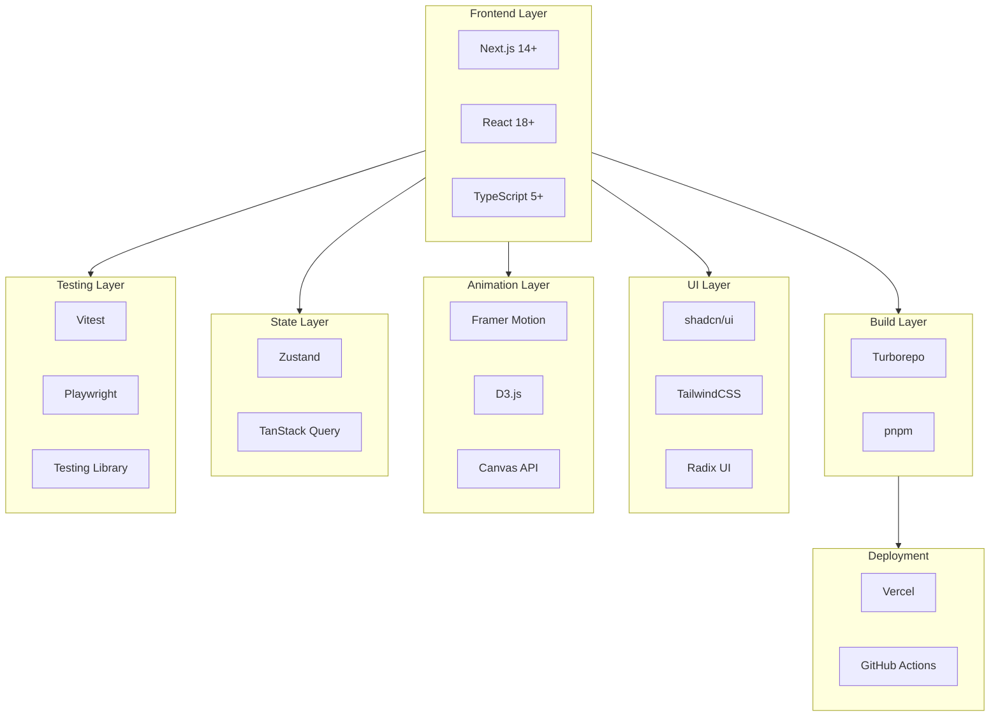

# OpenDSA - Technology Stack

> Comprehensive documentation of all technology choices and the rationale behind each decision.

## Table of Contents

1. [Overview](#overview)
2. [Core Framework](#core-framework)
3. [Build System](#build-system)
4. [UI and Styling](#ui-and-styling)
5. [Animations and Visualizations](#animations-and-visualizations)
6. [State Management](#state-management)
7. [Code Editor](#code-editor)
8. [Testing](#testing)
9. [Documentation](#documentation)
10. [Deployment](#deployment)
11. [Development Tools](#development-tools)
12. [Comparison with Current Stack](#comparison-with-current-stack)

---

## Overview

The OpenDSA tech stack is chosen based on the following criteria:

- **Industry Standard**: Widely adopted, well-documented technologies
- **Developer Experience**: Fast iteration, good tooling, TypeScript support
- **Performance**: Optimized for smooth animations and responsive UI
- **Open Source Friendly**: Easy for contributors to understand and work with
- **Scalability**: Can grow with the project's needs
- **Maintainability**: Long-term support, active communities



---

## Core Framework

### Next.js 14+ (App Router)

**Choice**: Next.js with App Router

**Alternatives Considered**:
- Vite + React (current stack)
- Remix
- Astro
- Create React App

**Rationale**:

| Feature | Next.js | Vite + React | Remix |
|---------|---------|--------------|-------|
| SSR/SSG | Built-in | Manual | Built-in |
| File-based routing | Yes | No | Yes |
| API routes | Yes | No | Yes |
| Image optimization | Built-in | Manual | Manual |
| Vercel integration | Native | Good | Good |
| App Router (RSC) | Yes | No | No |
| Community/Ecosystem | Largest | Large | Growing |

**Key Benefits**:
1. **Server Components**: Reduce client bundle size
2. **File-based Routing**: Intuitive, less boilerplate
3. **Built-in Optimizations**: Images, fonts, scripts
4. **Vercel Deployment**: Zero-config, preview deployments
5. **SEO**: Better for marketing site
6. **Ecosystem**: Vast plugin and tool support

**Configuration**:
```typescript
// next.config.js
/** @type {import('next').NextConfig} */
const nextConfig = {
  experimental: {
    typedRoutes: true,
  },
  images: {
    remotePatterns: [
      { hostname: 'avatars.githubusercontent.com' },
    ],
  },
  transpilePackages: [
    '@opendsa/ui',
    '@opendsa/visualizers',
    '@opendsa/algorithms',
  ],
};

export default nextConfig;
```

---

### TypeScript 5+

**Choice**: TypeScript with strict mode

**Alternatives Considered**:
- JavaScript (current stack)
- JSDoc type annotations

**Rationale**:

1. **Type Safety**: Catch errors at compile time
2. **Better DX**: Autocomplete, refactoring support
3. **Documentation**: Types serve as documentation
4. **Contributor Experience**: Easier to understand codebase
5. **Industry Standard**: Expected for serious projects

**Configuration**:
```json
// tsconfig.json
{
  "compilerOptions": {
    "strict": true,
    "noUncheckedIndexedAccess": true,
    "noImplicitReturns": true,
    "noFallthroughCasesInSwitch": true,
    "exactOptionalPropertyTypes": true,
    "moduleResolution": "bundler",
    "module": "ESNext",
    "target": "ES2022",
    "lib": ["DOM", "DOM.Iterable", "ES2022"],
    "jsx": "preserve",
    "incremental": true,
    "paths": {
      "@/*": ["./src/*"],
      "@opendsa/ui": ["../../packages/ui/src"],
      "@opendsa/algorithms": ["../../packages/algorithms/src"],
      "@opendsa/visualizers": ["../../packages/visualizers/src"],
      "@opendsa/types": ["../../packages/types/src"],
      "@opendsa/utils": ["../../packages/utils/src"]
    }
  }
}
```

---

### pnpm

**Choice**: pnpm as package manager

**Alternatives Considered**:
- npm (current)
- yarn
- bun

**Rationale**:

| Feature | pnpm | npm | yarn | bun |
|---------|------|-----|------|-----|
| Disk space | Best | Worst | Medium | Best |
| Install speed | Fast | Slow | Medium | Fastest |
| Monorepo support | Native | Limited | Good | Growing |
| Strict mode | Yes | No | No | No |
| Stability | Excellent | Excellent | Good | Beta |

**Key Benefits**:
1. **Efficient Storage**: Content-addressable store, symlinks
2. **Fast**: Up to 2x faster than npm
3. **Strict**: Prevents phantom dependencies
4. **Monorepo Native**: Built-in workspace support
5. **Industry Adoption**: Used by Vue, Vite, Turborepo

---

## Build System

### Turborepo

**Choice**: Turborepo for monorepo management

**Alternatives Considered**:
- Nx
- Lerna
- Rush
- No monorepo (separate repos)

**Rationale**:

| Feature | Turborepo | Nx | Lerna |
|---------|-----------|-----|-------|
| Learning curve | Low | High | Medium |
| Build caching | Excellent | Excellent | Limited |
| Remote caching | Vercel | Nx Cloud | No |
| Configuration | Minimal | Complex | Moderate |
| Vercel integration | Native | Manual | Manual |

**Key Benefits**:
1. **Simple Configuration**: Single `turbo.json`
2. **Intelligent Caching**: Local and remote caching
3. **Parallel Execution**: Run tasks in parallel
4. **Vercel Integration**: Free remote caching
5. **Incremental Builds**: Only rebuild what changed

**Configuration** (Turborepo 2.0+):
```json
// turbo.json
{
  "$schema": "https://turborepo.dev/schema.json",
  "globalDependencies": ["**/.env.*local"],
  "tasks": {
    "build": {
      "dependsOn": ["^build"],
      "outputs": [".next/**", "!.next/cache/**", "dist/**"]
    },
    "lint": {},
    "test": {
      "dependsOn": ["^build"]
    },
    "dev": {
      "cache": false,
      "persistent": true
    },
    "type-check": {
      "dependsOn": ["^type-check"]
    }
  }
}
```

---

## UI and Styling

### shadcn/ui

**Choice**: shadcn/ui component library

**Alternatives Considered**:
- NextUI (current)
- Radix UI (raw)
- Chakra UI
- MUI (Material UI)
- Mantine

**Rationale**:

| Feature | shadcn/ui | NextUI | Chakra UI | MUI |
|---------|-----------|--------|-----------|-----|
| Own the code | Yes | No | No | No |
| Bundle size | Minimal | Medium | Medium | Large |
| Customization | Full | Medium | Good | Complex |
| Accessibility | Excellent | Good | Excellent | Good |
| Tailwind native | Yes | Yes | No | No |
| Learning curve | Low | Low | Medium | High |

**Key Benefits**:
1. **Code Ownership**: Copy/paste, not a dependency
2. **Full Customization**: Modify anything
3. **Accessibility**: Built on Radix primitives
4. **Tailwind Native**: Works seamlessly
5. **Contributor Friendly**: Standard React components

**Example Component**:
```typescript
// packages/ui/src/components/button.tsx
import * as React from "react";
import { Slot } from "@radix-ui/react-slot";
import { cva, type VariantProps } from "class-variance-authority";
import { cn } from "../lib/utils";

const buttonVariants = cva(
  "inline-flex items-center justify-center rounded-md text-sm font-medium transition-colors focus-visible:outline-none focus-visible:ring-2 focus-visible:ring-ring disabled:pointer-events-none disabled:opacity-50",
  {
    variants: {
      variant: {
        default: "bg-primary text-primary-foreground hover:bg-primary/90",
        destructive: "bg-destructive text-destructive-foreground hover:bg-destructive/90",
        outline: "border border-input bg-background hover:bg-accent hover:text-accent-foreground",
        secondary: "bg-secondary text-secondary-foreground hover:bg-secondary/80",
        ghost: "hover:bg-accent hover:text-accent-foreground",
        link: "text-primary underline-offset-4 hover:underline",
      },
      size: {
        default: "h-10 px-4 py-2",
        sm: "h-9 rounded-md px-3",
        lg: "h-11 rounded-md px-8",
        icon: "h-10 w-10",
      },
    },
    defaultVariants: {
      variant: "default",
      size: "default",
    },
  }
);

export interface ButtonProps
  extends React.ButtonHTMLAttributes<HTMLButtonElement>,
    VariantProps<typeof buttonVariants> {
  asChild?: boolean;
}

const Button = React.forwardRef<HTMLButtonElement, ButtonProps>(
  ({ className, variant, size, asChild = false, ...props }, ref) => {
    const Comp = asChild ? Slot : "button";
    return (
      <Comp
        className={cn(buttonVariants({ variant, size, className }))}
        ref={ref}
        {...props}
      />
    );
  }
);
Button.displayName = "Button";

export { Button, buttonVariants };
```

---

### TailwindCSS 3.4+

**Choice**: TailwindCSS for styling

**Alternatives Considered**:
- Styled Components (partially used in current)
- CSS Modules
- Emotion
- Vanilla CSS

**Rationale**:

| Feature | TailwindCSS | Styled Components | CSS Modules |
|---------|-------------|-------------------|-------------|
| Bundle size | Minimal (purged) | Runtime | Zero |
| DX | Excellent | Good | Medium |
| Design system | Built-in | Manual | Manual |
| Dark mode | Built-in | Manual | Manual |
| Responsiveness | Built-in | Manual | Manual |
| Type safety | With plugins | Partial | No |

**Key Benefits**:
1. **Utility-First**: Fast iteration
2. **Design Tokens**: Consistent spacing, colors
3. **Dark Mode**: Built-in support
4. **Responsive**: Mobile-first utilities
5. **Purging**: Only ships used CSS
6. **Industry Standard**: Widely known

**Configuration**:
```typescript
// tailwind.config.ts
import type { Config } from "tailwindcss";

const config: Config = {
  darkMode: "class",
  content: [
    "./app/**/*.{ts,tsx}",
    "./components/**/*.{ts,tsx}",
    "../../packages/ui/src/**/*.{ts,tsx}",
  ],
  theme: {
    extend: {
      colors: {
        border: "hsl(var(--border))",
        input: "hsl(var(--input))",
        ring: "hsl(var(--ring))",
        background: "hsl(var(--background))",
        foreground: "hsl(var(--foreground))",
        primary: {
          DEFAULT: "hsl(var(--primary))",
          foreground: "hsl(var(--primary-foreground))",
        },
        secondary: {
          DEFAULT: "hsl(var(--secondary))",
          foreground: "hsl(var(--secondary-foreground))",
        },
        destructive: {
          DEFAULT: "hsl(var(--destructive))",
          foreground: "hsl(var(--destructive-foreground))",
        },
        muted: {
          DEFAULT: "hsl(var(--muted))",
          foreground: "hsl(var(--muted-foreground))",
        },
        accent: {
          DEFAULT: "hsl(var(--accent))",
          foreground: "hsl(var(--accent-foreground))",
        },
        // Algorithm-specific colors
        compare: "hsl(var(--compare))",
        swap: "hsl(var(--swap))",
        sorted: "hsl(var(--sorted))",
        pivot: "hsl(var(--pivot))",
        visited: "hsl(var(--visited))",
        current: "hsl(var(--current))",
        found: "hsl(var(--found))",
      },
      animation: {
        "slide-in": "slideIn 0.3s ease-out",
        "fade-in": "fadeIn 0.2s ease-out",
        "scale-in": "scaleIn 0.2s ease-out",
        "bar-swap": "barSwap 0.3s ease-in-out",
      },
      keyframes: {
        slideIn: {
          from: { transform: "translateY(-10px)", opacity: "0" },
          to: { transform: "translateY(0)", opacity: "1" },
        },
        fadeIn: {
          from: { opacity: "0" },
          to: { opacity: "1" },
        },
        scaleIn: {
          from: { transform: "scale(0.95)", opacity: "0" },
          to: { transform: "scale(1)", opacity: "1" },
        },
        barSwap: {
          "0%": { transform: "translateX(0)" },
          "50%": { transform: "translateY(-10px)" },
          "100%": { transform: "translateX(var(--swap-distance))" },
        },
      },
    },
  },
  plugins: [require("tailwindcss-animate")],
};

export default config;
```

---

## Animations and Visualizations

### Framer Motion

**Choice**: Framer Motion for UI animations

**Alternatives Considered**:
- React Spring
- GSAP
- CSS animations only
- Motion One

**Rationale**:

| Feature | Framer Motion | GSAP | React Spring | Motion One |
|---------|---------------|------|--------------|------------|
| React integration | Native | Wrapper | Native | Native |
| Bundle size | Medium (20kb) | Large (60kb) | Medium | Small (3kb) |
| Learning curve | Low | Medium | Medium | Low |
| Layout animations | Excellent | Manual | Limited | No |
| Gestures | Built-in | Plugin | Limited | No |
| SSR | Yes | Manual | Yes | Yes |

**Key Benefits**:
1. **Declarative**: Animate with props
2. **Layout Animations**: `layout` prop magic
3. **Gestures**: Drag, tap, hover built-in
4. **Exit Animations**: `AnimatePresence`
5. **Spring Physics**: Natural motion

**Use Cases in OpenDSA**:
```typescript
// Page transitions
<motion.div
  initial={{ opacity: 0, y: 20 }}
  animate={{ opacity: 1, y: 0 }}
  exit={{ opacity: 0, y: -20 }}
  transition={{ duration: 0.3 }}
>
  {children}
</motion.div>

// Control panel animations
<motion.button
  whileHover={{ scale: 1.05 }}
  whileTap={{ scale: 0.95 }}
>
  Play
</motion.button>

// Sidebar toggle
<motion.aside
  initial={false}
  animate={{ width: isOpen ? 280 : 0 }}
  transition={{ type: "spring", stiffness: 300, damping: 30 }}
>
  {/* Sidebar content */}
</motion.aside>
```

---

### D3.js

**Choice**: D3.js for complex data visualizations

**Alternatives Considered**:
- Chart.js
- Recharts
- Visx
- Pure SVG/Canvas

**Rationale**:

| Feature | D3.js | Recharts | Visx | Chart.js |
|---------|-------|----------|------|----------|
| Flexibility | Full | Limited | Full | Limited |
| Learning curve | High | Low | Medium | Low |
| Custom visualizations | Excellent | Poor | Good | Poor |
| Animation control | Full | Limited | Good | Limited |
| SVG manipulation | Native | Abstracted | Native | Canvas |

**Key Benefits**:
1. **Full Control**: Build any visualization
2. **Data Binding**: Efficient updates
3. **Transitions**: Smooth, customizable
4. **Scales**: Map data to visual properties
5. **Existing Knowledge**: Already used in current project

**Use Cases in OpenDSA**:
- Graph algorithms (BFS, DFS, Dijkstra)
- Tree visualizations (BST, traversals)
- Complex sorting visualizations (bars, with animations)
- Linked list visualizations

**Example**:
```typescript
// Graph visualization with D3
import * as d3 from 'd3';

function renderGraph(container: HTMLElement, nodes: Node[], edges: Edge[]) {
  const svg = d3.select(container)
    .append('svg')
    .attr('width', '100%')
    .attr('height', '100%');

  const simulation = d3.forceSimulation(nodes)
    .force('link', d3.forceLink(edges).id(d => d.id))
    .force('charge', d3.forceManyBody().strength(-300))
    .force('center', d3.forceCenter(width / 2, height / 2));

  // Render edges
  const link = svg.selectAll('.link')
    .data(edges)
    .join('line')
    .attr('class', 'link')
    .attr('stroke', '#999');

  // Render nodes
  const node = svg.selectAll('.node')
    .data(nodes)
    .join('circle')
    .attr('class', 'node')
    .attr('r', 20)
    .attr('fill', d => d.visited ? 'var(--visited)' : 'var(--default)');

  // Update positions on tick
  simulation.on('tick', () => {
    link
      .attr('x1', d => d.source.x)
      .attr('y1', d => d.source.y)
      .attr('x2', d => d.target.x)
      .attr('y2', d => d.target.y);

    node
      .attr('cx', d => d.x)
      .attr('cy', d => d.y);
  });
}
```

---

### Canvas API

**Choice**: Canvas API for high-performance array visualizations

**Rationale**:
- **Performance**: Handle 100+ elements at 60fps
- **Control**: Pixel-level manipulation
- **Memory**: Lower memory usage than SVG for many elements

**Use Cases**:
- Large array sorting visualizations (>50 elements)
- Performance-critical animations
- Real-time data updates

**Example**:
```typescript
// High-performance array visualization
function renderArray(
  canvas: HTMLCanvasElement,
  array: number[],
  highlights: Map<number, string>
) {
  const ctx = canvas.getContext('2d')!;
  const { width, height } = canvas;
  const barWidth = width / array.length;
  const maxValue = Math.max(...array);

  ctx.clearRect(0, 0, width, height);

  array.forEach((value, index) => {
    const barHeight = (value / maxValue) * (height - 20);
    const x = index * barWidth;
    const y = height - barHeight;

    // Set color based on state
    ctx.fillStyle = highlights.get(index) || 'hsl(var(--primary))';
    ctx.fillRect(x + 1, y, barWidth - 2, barHeight);

    // Draw value label for small arrays
    if (array.length <= 30) {
      ctx.fillStyle = 'hsl(var(--foreground))';
      ctx.font = '12px sans-serif';
      ctx.textAlign = 'center';
      ctx.fillText(value.toString(), x + barWidth / 2, y - 5);
    }
  });
}
```

---

## State Management

### Zustand

**Choice**: Zustand for global state

**Alternatives Considered**:
- Redux Toolkit (current)
- Jotai
- Recoil
- React Context

**Rationale**:

| Feature | Zustand | Redux Toolkit | Jotai | Context |
|---------|---------|---------------|-------|---------|
| Bundle size | 1kb | 11kb | 2kb | 0kb |
| Boilerplate | Minimal | Medium | Minimal | Medium |
| Learning curve | Low | Medium | Low | Low |
| DevTools | Yes | Excellent | Yes | Limited |
| TypeScript | Excellent | Good | Excellent | Good |
| Middleware | Yes | Yes | Limited | Manual |

**Key Benefits**:
1. **Simplicity**: Minimal boilerplate
2. **Performance**: Selective re-renders out of box
3. **TypeScript**: Great type inference
4. **Flexibility**: No providers required
5. **Size**: Tiny bundle impact

**Store Structure**:
```typescript
// Visualization store
interface VisualizerStore {
  // State
  visualizerId: string | null;
  data: unknown;
  steps: AnimationStep[];
  currentStep: number;
  isPlaying: boolean;
  speed: number;

  // Actions
  setVisualizer: (id: string) => void;
  setData: (data: unknown) => void;
  generateSteps: () => void;
  play: () => void;
  pause: () => void;
  reset: () => void;
  stepForward: () => void;
  stepBackward: () => void;
  setSpeed: (speed: number) => void;
}

// Preferences store (persisted)
interface PreferencesStore {
  theme: 'light' | 'dark' | 'system';
  editorVisible: boolean;
  sidebarOpen: boolean;
  keyboardShortcutsEnabled: boolean;

  setTheme: (theme: 'light' | 'dark' | 'system') => void;
  toggleEditor: () => void;
  toggleSidebar: () => void;
  toggleKeyboardShortcuts: () => void;
}
```

---

## Code Editor

### Monaco Editor

**Choice**: Monaco Editor (same as VS Code)

**Alternatives Considered**:
- CodeMirror 6
- Ace Editor
- Prism.js (display only)

**Rationale**:

| Feature | Monaco | CodeMirror 6 | Ace |
|---------|--------|--------------|-----|
| IntelliSense | Full | Plugin | Limited |
| Bundle size | Large (2MB) | Medium | Medium |
| Features | Complete | Good | Good |
| Familiarity | VS Code | Learning | Old |
| TypeScript | Native | Plugin | Plugin |

**Key Benefits**:
1. **VS Code Experience**: Familiar to developers
2. **IntelliSense**: Autocomplete, errors
3. **TypeScript**: Native support
4. **Themes**: VS Code themes work

**Configuration**:
```typescript
// Monaco editor setup
import { Editor, OnMount } from '@monaco-editor/react';

interface CodeEditorProps {
  code: string;
  language: string;
  highlightLines?: number[];
  readOnly?: boolean;
  onChange?: (value: string) => void;
}

export function CodeEditor({
  code,
  language,
  highlightLines = [],
  readOnly = false,
  onChange,
}: CodeEditorProps) {
  const handleMount: OnMount = (editor, monaco) => {
    // Configure editor
    editor.updateOptions({
      minimap: { enabled: false },
      lineNumbers: 'on',
      scrollBeyondLastLine: false,
      readOnly,
      fontSize: 14,
    });

    // Highlight lines
    if (highlightLines.length > 0) {
      editor.deltaDecorations([], highlightLines.map(line => ({
        range: new monaco.Range(line, 1, line, 1),
        options: {
          isWholeLine: true,
          className: 'highlighted-line',
          glyphMarginClassName: 'highlighted-glyph',
        },
      })));
    }
  };

  return (
    <Editor
      height="100%"
      language={language}
      value={code}
      onMount={handleMount}
      onChange={(value) => onChange?.(value ?? '')}
      theme="vs-dark"
    />
  );
}
```

---

## Testing

### Vitest

**Choice**: Vitest for unit testing

**Alternatives Considered**:
- Jest
- Node test runner
- Mocha

**Rationale**:

| Feature | Vitest | Jest |
|---------|--------|------|
| Speed | Fast (native ESM) | Slower |
| Vite integration | Native | Manual |
| Watch mode | Excellent | Good |
| API compatibility | Jest-compatible | - |
| TypeScript | Native | Plugin |

**Configuration**:
```typescript
// vitest.config.ts
import { defineConfig } from 'vitest/config';
import react from '@vitejs/plugin-react';

export default defineConfig({
  plugins: [react()],
  test: {
    environment: 'jsdom',
    globals: true,
    setupFiles: ['./test/setup.ts'],
    coverage: {
      provider: 'v8',
      reporter: ['text', 'json', 'html'],
      exclude: ['node_modules/', 'test/'],
    },
  },
});
```

---

### Playwright

**Choice**: Playwright for E2E testing

**Alternatives Considered**:
- Cypress
- Puppeteer
- TestCafe

**Rationale**:

| Feature | Playwright | Cypress |
|---------|------------|---------|
| Browsers | All | Chrome, Firefox, Edge |
| Speed | Faster | Slower |
| Auto-wait | Better | Good |
| Parallelism | Built-in | Paid |
| Cross-origin | Yes | Limited |

**Configuration**:
```typescript
// playwright.config.ts
import { defineConfig, devices } from '@playwright/test';

export default defineConfig({
  testDir: './e2e',
  fullyParallel: true,
  forbidOnly: !!process.env.CI,
  retries: process.env.CI ? 2 : 0,
  workers: process.env.CI ? 1 : undefined,
  reporter: 'html',
  use: {
    baseURL: 'http://localhost:3000',
    trace: 'on-first-retry',
  },
  projects: [
    { name: 'chromium', use: { ...devices['Desktop Chrome'] } },
    { name: 'firefox', use: { ...devices['Desktop Firefox'] } },
    { name: 'webkit', use: { ...devices['Desktop Safari'] } },
  ],
  webServer: {
    command: 'pnpm dev',
    url: 'http://localhost:3000',
    reuseExistingServer: !process.env.CI,
  },
});
```

---

## Documentation

### Nextra

**Choice**: Nextra for documentation site

**Alternatives Considered**:
- Docusaurus
- Fumadocs
- VitePress
- GitBook

**Rationale**:

| Feature | Nextra | Docusaurus | Fumadocs |
|---------|--------|------------|----------|
| Framework | Next.js | React | Next.js |
| Setup | Simple | Medium | Simple |
| MDX | Native | Native | Native |
| Search | Built-in | Plugin | Built-in |
| Customization | Full | Good | Full |

**Key Benefits**:
1. **Next.js Native**: Same stack as apps
2. **MDX**: React components in docs
3. **Search**: Full-text search built-in
4. **Theme**: Beautiful default theme
5. **Simple**: Minimal configuration

---

## Deployment

### Vercel

**Choice**: Vercel for hosting

**Alternatives Considered**:
- Netlify (current)
- AWS Amplify
- Cloudflare Pages
- Self-hosted

**Rationale**:

| Feature | Vercel | Netlify | Cloudflare |
|---------|--------|---------|------------|
| Next.js support | Native | Good | Good |
| Preview deployments | Yes | Yes | Yes |
| Edge functions | Native | Beta | Native |
| Turborepo caching | Native | No | No |
| Pricing | Free tier | Free tier | Free tier |

**Key Benefits**:
1. **Next.js Creator**: Best Next.js support
2. **Preview Deployments**: Per-PR previews
3. **Turborepo Integration**: Remote caching
4. **Zero Config**: Automatic detection
5. **Free for OSS**: Open source program

---

### GitHub Actions

**Workflows**:

1. **CI (ci.yml)**: Runs on every PR
   - Lint
   - Type check
   - Unit tests
   - Build verification

2. **Release (release.yml)**: On merge to main
   - Deploy to production
   - Create release notes
   - Update changelog

3. **Dependency Update**: Weekly
   - Dependabot PRs
   - Security scanning

---

## Development Tools

### ESLint + Prettier

**Configuration**:
```javascript
// eslint.config.js
import eslint from '@eslint/js';
import tseslint from 'typescript-eslint';
import react from 'eslint-plugin-react';
import reactHooks from 'eslint-plugin-react-hooks';

export default tseslint.config(
  eslint.configs.recommended,
  ...tseslint.configs.strictTypeChecked,
  {
    plugins: {
      react,
      'react-hooks': reactHooks,
    },
    rules: {
      'react-hooks/rules-of-hooks': 'error',
      'react-hooks/exhaustive-deps': 'warn',
      '@typescript-eslint/no-unused-vars': ['error', { argsIgnorePattern: '^_' }],
    },
  }
);
```

---

## Comparison with Current Stack

| Aspect | Current (ds-algo-deck) | New (OpenDSA) | Reason for Change |
|--------|------------------------|----------------|-------------------|
| **Framework** | React + Vite | Next.js 14 | SSR, SEO, file routing, Vercel integration |
| **Language** | JavaScript | TypeScript | Type safety, better DX, documentation |
| **Package Manager** | npm | pnpm | Speed, disk efficiency, strict mode |
| **Build** | Single app | Turborepo | Code sharing, independent deployments |
| **UI Library** | NextUI | shadcn/ui | Code ownership, customization, smaller bundle |
| **State** | Redux Toolkit | Zustand | Simplicity, smaller bundle, less boilerplate |
| **Styling** | Tailwind + Styled Components | Tailwind only | Consistency, simpler mental model |
| **Animations** | Framer Motion + D3 | Same + Canvas | Add Canvas for performance |
| **Testing** | None | Vitest + Playwright | Quality assurance, contributor confidence |
| **Docs** | Markdown files | Nextra | Professional documentation site |
| **Deploy** | Netlify | Vercel | Better Next.js support, Turborepo integration |
| **CI/CD** | Manual | GitHub Actions | Automation, quality gates |

---

## Summary

The OpenDSA tech stack is carefully chosen to provide:

1. **Modern Foundation**: Next.js + TypeScript + pnpm
2. **Scalable Architecture**: Turborepo monorepo
3. **Beautiful UI**: shadcn/ui + TailwindCSS
4. **Smooth Animations**: Framer Motion + D3.js + Canvas
5. **Simple State**: Zustand
6. **Quality Assurance**: Vitest + Playwright
7. **Great DX**: ESLint + Prettier + TypeScript
8. **Easy Deployment**: Vercel + GitHub Actions

This stack balances **developer experience**, **performance**, **maintainability**, and **contributor friendliness** - all essential for a successful open-source project.
