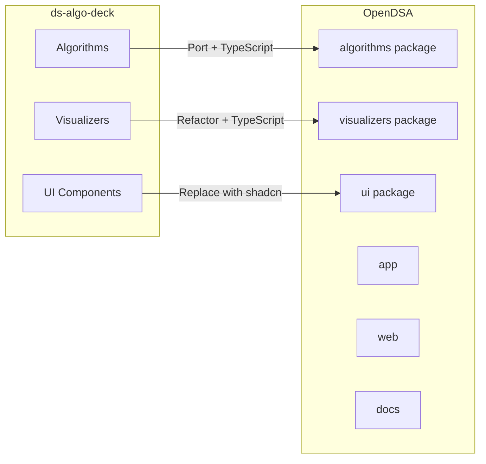
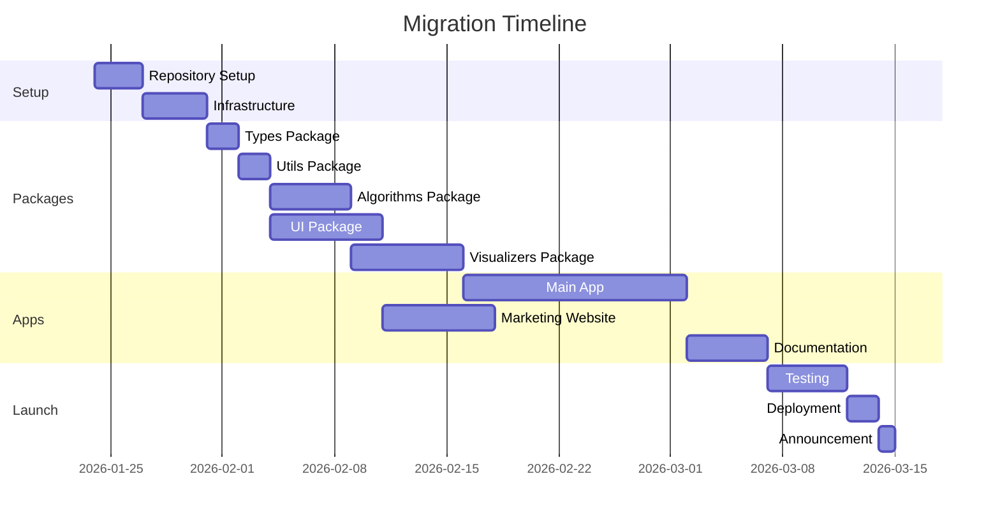

# OpenDSA - Migration Guide

> Step-by-step guide for migrating from ds-algo-deck (current project) to OpenDSA (new project).

## Table of Contents

1. [Overview](#overview)
2. [Migration Strategy](#migration-strategy)
3. [Pre-Migration Checklist](#pre-migration-checklist)
4. [Phase 1: Repository Setup](#phase-1-repository-setup)
5. [Phase 2: Package Migration](#phase-2-package-migration)
6. [Phase 3: Application Migration](#phase-3-application-migration)
7. [Phase 4: Testing and Verification](#phase-4-testing-and-verification)
8. [Phase 5: Deployment](#phase-5-deployment)
9. [Post-Migration Tasks](#post-migration-tasks)
10. [Rollback Plan](#rollback-plan)

---

## Overview

### Current State (ds-algo-deck)

| Aspect | Details |
|--------|---------|
| **Framework** | React 18 + Vite |
| **Language** | JavaScript (JSX) |
| **State** | Redux Toolkit |
| **UI** | NextUI + TailwindCSS + Styled Components |
| **Animations** | D3.js + Framer Motion |
| **Routing** | React Router DOM |
| **Deployment** | Netlify |

### Target State (OpenDSA)

| Aspect | Details |
|--------|---------|
| **Framework** | Next.js 14 (App Router) |
| **Language** | TypeScript (strict) |
| **State** | Zustand |
| **UI** | shadcn/ui + TailwindCSS |
| **Animations** | D3.js + Framer Motion + Canvas |
| **Routing** | Next.js App Router |
| **Deployment** | Vercel |

### Migration Approach



---

## Migration Strategy

### Guiding Principles

1. **Incremental Migration**: Migrate piece by piece, not all at once
2. **Parallel Operation**: Keep ds-algo-deck running until OpenDSA reaches feature parity
3. **Test Early**: Write tests as you migrate
4. **Document Changes**: Note any improvements or changes made during migration

### Timeline



---

## Pre-Migration Checklist

Before starting the migration, ensure:

### Current Project Audit

- [ ] **Document all existing features**
  - List all implemented visualizers
  - Note all UI components used
  - Document current routing structure
  - List all Redux slices and state shape

- [ ] **Identify what to keep**
  - Algorithm implementations (bubble sort, linear search, etc.)
  - Animation logic patterns
  - D3.js visualization code
  - Useful utility functions

- [ ] **Identify what to discard**
  - Unused code/components
  - Deprecated patterns
  - Temporary/debug code

### Preparation

- [ ] **Create GitHub organization**: `opendsa`
- [ ] **Reserve domain**: `opendsa.dev` or alternative
- [ ] **Set up Vercel account**: Link to GitHub org
- [ ] **Create Discord server**: For community
- [ ] **Prepare announcement**: Blog post, social media

---

## Phase 1: Repository Setup

### 1.1 Create New Repository

```bash
# Create new directory
mkdir opendsa
cd opendsa

# Initialize git
git init

# Create initial structure
mkdir -p apps/{app,web,docs}
mkdir -p packages/{ui,algorithms,visualizers,types,utils,config}
mkdir -p .github/{workflows,ISSUE_TEMPLATE}
```

### 1.2 Initialize Turborepo

```bash
# Initialize pnpm
pnpm init

# Create pnpm-workspace.yaml
cat > pnpm-workspace.yaml << 'EOF'
packages:
  - "apps/*"
  - "packages/*"
EOF

# Create turbo.json (Turborepo 2.0+ uses "tasks" instead of "pipeline")
cat > turbo.json << 'EOF'
{
  "$schema": "https://turborepo.dev/schema.json",
  "globalDependencies": ["**/.env.*local"],
  "tasks": {
    "build": {
      "dependsOn": ["^build"],
      "outputs": [".next/**", "!.next/cache/**", "dist/**"]
    },
    "lint": {},
    "test": {
      "dependsOn": ["^build"]
    },
    "dev": {
      "cache": false,
      "persistent": true
    },
    "type-check": {
      "dependsOn": ["^type-check"]
    }
  }
}
EOF
```

### 1.3 Configure Root Package.json

```json
{
  "name": "opendsa",
  "private": true,
  "scripts": {
    "dev": "turbo dev",
    "build": "turbo build",
    "lint": "turbo lint",
    "test": "turbo test",
    "type-check": "turbo type-check",
    "format": "prettier --write \"**/*.{ts,tsx,md}\"",
    "prepare": "husky install"
  },
  "devDependencies": {
    "@opendsa/config": "workspace:*",
    "husky": "^8.0.0",
    "lint-staged": "^15.0.0",
    "prettier": "^3.1.0",
    "turbo": "^1.11.0"
  },
  "packageManager": "pnpm@8.10.0",
  "engines": {
    "node": ">=18.17.0"
  }
}
```

### 1.4 Set Up GitHub Actions

**`.github/workflows/ci.yml`**:

```yaml
name: CI

on:
  push:
    branches: [main, dev]
  pull_request:
    branches: [main, dev]

jobs:
  build:
    runs-on: ubuntu-latest
    
    steps:
      - uses: actions/checkout@v4
      
      - uses: pnpm/action-setup@v2
        with:
          version: 8
          
      - uses: actions/setup-node@v4
        with:
          node-version: 20
          cache: 'pnpm'
          
      - name: Install dependencies
        run: pnpm install
        
      - name: Lint
        run: pnpm lint
        
      - name: Type check
        run: pnpm type-check
        
      - name: Test
        run: pnpm test
        
      - name: Build
        run: pnpm build
```

### 1.5 Create Branch Structure

```bash
# Create and push main branch
git add .
git commit -m "chore: initial repository setup"
git branch -M main
git remote add origin https://github.com/soloshun/opendsa.git
git push -u origin main

# Create dev branch
git checkout -b dev
git push -u origin dev
```

### Checklist: Phase 1

- [ ] Repository created on GitHub
- [ ] Turborepo configured
- [ ] pnpm workspaces set up
- [ ] CI/CD pipeline working
- [ ] Branch protection rules enabled
- [ ] Issue templates created
- [ ] PR template created

---

## Phase 2: Package Migration

### 2.1 Types Package (`@opendsa/types`)

**Files to create**:

```
packages/types/
├── src/
│   ├── algorithm.types.ts
│   ├── animation.types.ts
│   ├── visualizer.types.ts
│   └── index.ts
├── package.json
└── tsconfig.json
```

**Migration tasks**:

- [ ] Create `AnimationStep` type (from current step structure)
- [ ] Create `VisualizerPlugin` interface
- [ ] Create `ControlsProps` interface
- [ ] Create algorithm-specific types
- [ ] Export all types

### 2.2 Utils Package (`@opendsa/utils`)

**Migrate from current project**:

| Current File | New Location |
|--------------|--------------|
| `src/utils/utils.js` | `packages/utils/src/general.ts` |
| `src/utils/d3Helpers.js` | `packages/utils/src/d3-helpers.ts` |
| `src/utils/animations.js` | `packages/visualizers/src/engine/` |

**Migration tasks**:

- [ ] Port utility functions to TypeScript
- [ ] Add type annotations
- [ ] Write unit tests
- [ ] Remove unused utilities

### 2.3 Algorithms Package (`@opendsa/algorithms`)

**Migrate from current project**:

| Current File | New Location |
|--------------|--------------|
| `src/data/algorithms/bubbleSort.js` | `packages/algorithms/src/sorting/bubble-sort.ts` |
| Bubble sort step generation (in slice) | `packages/algorithms/src/sorting/bubble-sort.ts` |
| Linear search step generation (in slice) | `packages/algorithms/src/searching/linear-search.ts` |

**Migration tasks**:

- [ ] Port bubble sort algorithm
  ```typescript
  // Current (bubbleSortVisualizerSlice.js)
  generateSortingSteps() // Extract this logic
  
  // New (packages/algorithms/src/sorting/bubble-sort.ts)
  export function bubbleSort(array: number[]): number[] { ... }
  export function bubbleSortSteps(array: number[]): AnimationStep[] { ... }
  ```

- [ ] Port linear search algorithm
- [ ] Port array operations
- [ ] Add TypeScript types
- [ ] Write comprehensive tests
- [ ] Add JSDoc documentation

### 2.4 UI Package (`@opendsa/ui`)

**Replace NextUI with shadcn/ui**:

| NextUI Component | shadcn/ui Equivalent |
|------------------|---------------------|
| `Button` | `Button` |
| `Input` | `Input` |
| `Card` | `Card` |
| `Slider` | `Slider` |
| `Tooltip` | `Tooltip` |
| `Popover` | `Popover` |
| `Dropdown` | `DropdownMenu` |
| `Modal` | `Dialog` |
| `Navbar` | Custom (Tailwind) |

**Migration tasks**:

- [ ] Initialize shadcn/ui in packages/ui
- [ ] Add required components:
  - [ ] Button
  - [ ] Input
  - [ ] Slider
  - [ ] Card
  - [ ] Dialog
  - [ ] Popover
  - [ ] Tooltip
  - [ ] Tabs
- [ ] Configure Tailwind
- [ ] Set up theme CSS variables
- [ ] Create algorithm-specific color tokens

### 2.5 Visualizers Package (`@opendsa/visualizers`)

**Migrate from current project**:

| Current File | New Location |
|--------------|--------------|
| `src/components/visualizer/algorithms/sorting/BubbleSortVisualizer.jsx` | `packages/visualizers/src/sorting/BubbleSortVisualizer.tsx` |
| `src/components/visualizer/algorithms/sorting/BubbleSortControl.jsx` | `packages/visualizers/src/sorting/BubbleSortControls.tsx` |
| `src/components/visualizer/algorithms/searching/LinearSearchVisualizer.jsx` | `packages/visualizers/src/searching/LinearSearchVisualizer.tsx` |
| `src/components/visualizer/data_structures/array/ArrayVisualizer.jsx` | `packages/visualizers/src/data-structures/ArrayVisualizer.tsx` |

**Migration tasks**:

- [ ] Create animation engine
  - [ ] Port animation timing logic from Redux slices
  - [ ] Create `useAnimation` hook
  - [ ] Implement step-based playback

- [ ] Port BubbleSortVisualizer
  - [ ] Convert to TypeScript
  - [ ] Use new animation engine
  - [ ] Replace D3.js patterns if needed
  - [ ] Use shadcn/ui components

- [ ] Port LinearSearchVisualizer
- [ ] Port ArrayVisualizer
- [ ] Create plugin registry system
- [ ] Register all visualizers

### Checklist: Phase 2

- [ ] All packages created with proper structure
- [ ] TypeScript configured in all packages
- [ ] Algorithms migrated and tested
- [ ] UI components set up with shadcn/ui
- [ ] Visualizers ported to TypeScript
- [ ] Animation engine implemented
- [ ] All packages export correctly

---

## Phase 3: Application Migration

### 3.1 Main App (`apps/app`)

**Set up Next.js**:

```bash
cd apps/app
pnpm create next-app@latest . --typescript --tailwind --eslint --app --src-dir --import-alias "@/*"
```

**Migrate routing structure**:

| Current Route | New Route |
|---------------|-----------|
| `/` | `/` (Dashboard) |
| `/playground` | `/visualize/[category]/[algorithm]` |
| `/resources` | Move to web app |
| `/practice-mode` | `/playground` |

**Migration tasks**:

- [ ] Set up app structure
  ```
  apps/app/
  ├── app/
  │   ├── page.tsx                    # Dashboard
  │   ├── layout.tsx                  # Root layout
  │   ├── visualize/
  │   │   ├── page.tsx                # Category list
  │   │   └── [category]/
  │   │       ├── page.tsx            # Algorithm list
  │   │       └── [algorithm]/
  │   │           └── page.tsx        # Visualizer page
  │   └── playground/
  │       └── page.tsx                # Free playground
  ├── components/
  │   ├── sidebar/
  │   ├── visualizer/
  │   └── controls/
  └── lib/
      ├── store.ts
      └── hooks/
  ```

- [ ] Port layout components
  - [ ] Migrate sidebar navigation
  - [ ] Create new header/nav
  - [ ] Implement responsive layout

- [ ] Port visualizer page
  - [ ] Connect to visualizer package
  - [ ] Implement controls
  - [ ] Add code editor

- [ ] Set up Zustand store
  - [ ] Create visualizer slice
  - [ ] Create preferences slice
  - [ ] Add URL state sync

### 3.2 Marketing Website (`apps/web`)

**Create new landing page**:

- [ ] Set up Next.js
- [ ] Create hero section
- [ ] Create features section
- [ ] Create CTA section
- [ ] Add navigation
- [ ] Add footer

### 3.3 Documentation (`apps/docs`)

**Set up Nextra**:

```bash
cd apps/docs
pnpm add nextra nextra-theme-docs
```

**Create initial pages**:

- [ ] Getting started
- [ ] Installation
- [ ] Quick start
- [ ] Contributing guide
- [ ] Architecture overview

### Checklist: Phase 3

- [ ] Main app routes working
- [ ] All visualizers accessible
- [ ] Animations working correctly
- [ ] State management functional
- [ ] Marketing site live
- [ ] Documentation searchable
- [ ] SEO configured

---

## Phase 4: Testing and Verification

### 4.1 Unit Tests

**Test coverage targets**:

| Package | Target Coverage |
|---------|-----------------|
| `@opendsa/algorithms` | 90%+ |
| `@opendsa/utils` | 80%+ |
| `@opendsa/visualizers` | 70%+ |

**Tests to write**:

- [ ] Algorithm correctness tests
- [ ] Step generation tests
- [ ] Animation hook tests
- [ ] Store action tests

### 4.2 Component Tests

- [ ] Visualizer component rendering
- [ ] Control panel interactions
- [ ] Theme switching
- [ ] Responsive behavior

### 4.3 E2E Tests

**Critical user flows**:

- [ ] Navigate to visualizer
- [ ] Play animation
- [ ] Change speed
- [ ] Step through animation
- [ ] Generate new array
- [ ] Share URL

### 4.4 Manual Testing Checklist

- [ ] All visualizers work correctly
- [ ] Animations are smooth (60fps)
- [ ] Controls respond properly
- [ ] Theme switching works
- [ ] Mobile/tablet responsive
- [ ] Keyboard shortcuts work
- [ ] URLs are shareable

### 4.5 Performance Testing

- [ ] Lighthouse score > 90
- [ ] Bundle size < 500KB (initial)
- [ ] Time to interactive < 3s
- [ ] Animation jank-free

---

## Phase 5: Deployment

### 5.1 Vercel Setup

```bash
# Install Vercel CLI
pnpm add -g vercel

# Link to Vercel
vercel link

# Configure project settings
vercel env add NEXT_PUBLIC_APP_URL
```

### 5.2 Domain Configuration

- [ ] Add domain to Vercel
- [ ] Configure DNS records
- [ ] Set up SSL certificate
- [ ] Configure redirects

### 5.3 Environment Variables

```bash
# Production
NEXT_PUBLIC_APP_URL=https://app.opendsa.dev
NEXT_PUBLIC_WEB_URL=https://opendsa.dev
NEXT_PUBLIC_DOCS_URL=https://docs.opendsa.dev
```

### 5.4 Deployment Checklist

- [ ] All environment variables set
- [ ] Build succeeds
- [ ] Preview deployment works
- [ ] Production deployment works
- [ ] Custom domain configured
- [ ] SSL working
- [ ] Analytics configured
- [ ] Error tracking set up

---

## Post-Migration Tasks

### Documentation

- [ ] Update README with new project info
- [ ] Create CHANGELOG
- [ ] Write migration blog post
- [ ] Update social media links

### Old Project

- [ ] Add deprecation notice to ds-algo-deck
- [ ] Link to new project
- [ ] Archive repository (after stability period)

### Community

- [ ] Announce launch on Discord
- [ ] Post on social media
- [ ] Submit to Hacker News/Reddit
- [ ] Reach out to tech blogs

### Monitoring

- [ ] Set up uptime monitoring
- [ ] Configure error alerts
- [ ] Monitor performance metrics
- [ ] Track user analytics

---

## Rollback Plan

If critical issues are discovered:

### Immediate Actions

1. **Revert deployment**: Use Vercel's instant rollback
2. **Communicate**: Post status update on Discord/Twitter
3. **Investigate**: Review error logs and reports

### Rollback Steps

```bash
# Revert to previous deployment on Vercel
vercel rollback

# Or revert to specific deployment
vercel rollback <deployment-url>
```

### Keep ds-algo-deck Running

- Maintain current Netlify deployment
- Do not archive until OpenDSA is stable
- Monitor both projects during transition

---

## Migration Tracking

Use this section to track migration progress:

### Overall Progress

| Phase | Status | Progress |
|-------|--------|----------|
| Phase 1: Repository Setup | Not Started | 0% |
| Phase 2: Package Migration | Not Started | 0% |
| Phase 3: Application Migration | Not Started | 0% |
| Phase 4: Testing | Not Started | 0% |
| Phase 5: Deployment | Not Started | 0% |

### Detailed Checklist

Copy and use in GitHub Issues for tracking:

```markdown
## Migration Checklist

### Phase 1: Repository Setup
- [ ] Create GitHub organization
- [ ] Initialize repository
- [ ] Configure Turborepo
- [ ] Set up CI/CD
- [ ] Create branch structure

### Phase 2: Package Migration
- [ ] @opendsa/types
- [ ] @opendsa/utils
- [ ] @opendsa/algorithms
- [ ] @opendsa/ui
- [ ] @opendsa/visualizers

### Phase 3: Application Migration
- [ ] apps/app (Main visualizer)
- [ ] apps/web (Marketing site)
- [ ] apps/docs (Documentation)

### Phase 4: Testing
- [ ] Unit tests passing
- [ ] E2E tests passing
- [ ] Manual testing complete
- [ ] Performance validated

### Phase 5: Deployment
- [ ] Vercel configured
- [ ] Domain set up
- [ ] Production deployed
- [ ] Monitoring active
```

---

## Questions and Support

If you encounter issues during migration:

1. **Check documentation**: Review architecture and tech stack docs
2. **Search issues**: Look for similar problems
3. **Ask in Discord**: Get help from the community
4. **Open an issue**: If it's a bug or missing documentation

---

*This migration guide will be updated as the migration progresses.*
